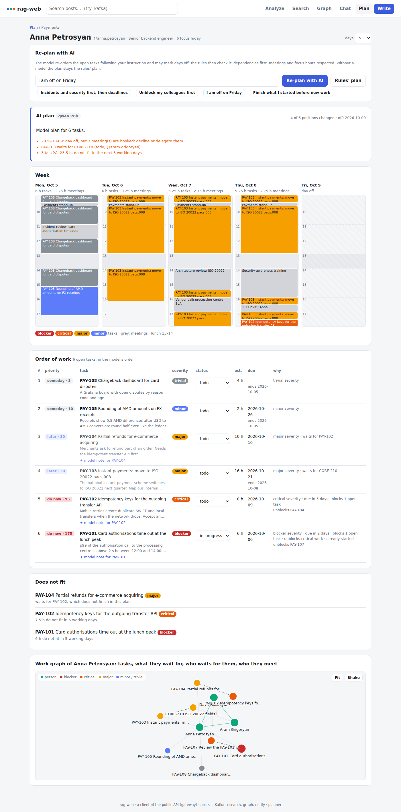

# air-harness

**An agent harness as a product.** Guides steer a coding agent *before* it acts; sensors tell it what went wrong
*after* — versioned, containerised, measured. air-harness ships with a small but real reference system (Python
microservices, signed service-to-service calls, PostgreSQL with a role per service, Flyway, Kafka, Prometheus)
so every guide and sensor works on running code from the first command.

> Guides steer before the act; sensors correct after it.


*A 46-second walkthrough of a real run — more in the [demo page](docs/en/07-demo.md) ([по-русски](docs/ru/07-demo.md)).*

**Documentation:** [docs/](docs/README.md) — what a harness is, how to use it, use cases, architecture,
components, low-level design and a demo, in [English](docs/en/01-what-is-a-harness.md) and
[Russian](docs/ru/01-what-is-a-harness.md).

## 1. Run it

```bash
./run.sh            # build + start everything, smoke-test it, print every URL and the next steps
./help.sh           # the guide, in your terminal
```

`./run.sh` checks your machine, starts the stack, waits until every service is healthy, creates a post, reads
it back, finds it through search, and prints where everything is:

```
Accessible URLs
  Web portal (rag-web)       http://localhost:8081  analyze · search · graph · chat · plan · write
  Public API                 http://localhost:8080  (opens the docs)
  API docs (Swagger UI)      http://localhost:8080/docs
  API docs (ReDoc)           http://localhost:8080/redoc
  OpenAPI schema             http://localhost:8080/openapi.json
  Gateway health / metrics   http://localhost:8080/healthz · /metrics
  Prometheus                 http://localhost:9090 · /targets · /alerts
  Local LLM                  http://localhost:11434/v1   (with --llm)
```

| Command | What it does |
|---|---|
| `./run.sh --console` | … and start the **web console** on http://127.0.0.1:8090 (also: `make console`) |
| `./run.sh` | start the stack (+ Prometheus), smoke test, URLs, next steps |
| `./run.sh --check` | … then prove the harness: selftest, fast loop, unit + contract suite |
| `./run.sh --full` | … `--check` plus the pipeline stage (search eval, alert rules) — what CI runs |
| `./run.sh --llm` | also start a local LLM (Ollama) for the review agent |
| `./run.sh --urls` | status and URLs of the running stack |
| `./run.sh --down` | stop (data is kept in `DATA_DIR`; `make purge` deletes it) |

Requirements: Docker Engine 26+ with Compose v2.24+, GNU make, bash, curl. The host-plane stages
(`--check`, `--full`) also need `python3` with PyYAML (`pip install pyyaml`). Configuration: every setting has
a default; `cp .env.example .env` to change one (`./help.sh config`).

### rag-web — the portal

http://localhost:8081 is the application's own web client, served by the `web` service and talking only to the
gateway. **Analyze** shows the knowledge graph at a glance (counts, top tags and authors, a topic map of tags that
share posts); **Search** finds posts by their words with tag and author facets; **Graph** is an explorer you grow
by clicking nodes (tag → posts, post → author, tags and related posts, author → posts); **Write** publishes a post
and shows search, graph and notify picking it up. Every post, tag and author has its own page. An empty graph
offers two sample datasets to start with (also `+ sample data` on Analyze).

**Sample data.** `./app.sh seed bank` (or `make seed d=bank`) loads **100 banking posts** by 10 authors: loans,
credit and credit scores, debit and accounts, mortgages, cards, payments, fraud, compliance (KYC, AML) and treasury,
linked by 35 tags into one knowledge graph; `./app.sh seed ibank` loads 46 posts about **iBank**, a stand-in name
for an Armenian bank modelled on the public website of Ardshinbank (ardshinbank.am): cards, loans and mortgages,
deposits, mobile and business banking, STATUS premium banking, each post with its source URL; `./app.sh seed general` loads 24 engineering posts. Seeding goes through
the public API, so search, the graph, notify and Chat all see the posts, and it is safe to repeat (posts already
there are skipped). Datasets are JSON files in `services/web/static/datasets/`; add your own and seed it by name or
path.


**Chat** answers questions from the posts with a fixed RAG pipeline in the `chat` service: search finds the
posts matching the question, the knowledge graph adds their closest neighbours, content supplies the full text,
and a language model answers citing them as `[#id]`, streamed word by word (`POST /api/chat`, server-sent events).
The model is any OpenAI-compatible endpoint: local Ollama by default (`./run.sh --llm` or `./app.sh up --llm`),
or a hosted one via `CHAT_LLM_URL`, `CHAT_MODEL`, `CHAT_LLM_API_KEY`. Without a model, Chat still answers with the
posts it found.


**Plan** is a work planner for a bank's IT staff (`planner` service). It holds employees, their Jira-style tasks
(severity, estimate, due date, dependencies) and their Outlook-style meetings. Every task gets a priority score with
readable reasons, and each person's week is filled around their meetings. **Re-plan with AI** lets the model re-order
a person's tasks following an instruction ("I am off on Friday; security first"), and the rules check its answer. Load
the sample team with `./app.sh seed planner`. Details: [Planner](docs/en/08-planner.md) ([по-русски](docs/ru/08-planner.md)).



### Only the application, without the harness

The RAG system runs on its own: no harness, console, make or python on the host, just Docker and curl.

```bash
./app.sh                    # build + start web, gateway, content, search, notify, graph, chat, planner (+ postgres, kafka, neo4j), smoke test, URLs
./app.sh test               # the API specification (contract suite) against it
./app.sh status · logs search · down
./app.sh export ../rag-app  # a standalone copy of the application, with no harness files: cd ../rag-app && ./app.sh
```

CI exports the application and runs it, plus its contract suite, from that copy on every PR, so the
application never starts depending on the harness.

### The console — everything in one web UI


`./run.sh --console` (or `make console` on a running stack) opens http://127.0.0.1:8090:

| Tab | What you do there |
|---|---|
| **Overview** | stack health, the harness verdict, how the loop works, quick actions |
| **API** | call every public endpoint from forms generated from the gateway's OpenAPI: request, response, status, latency, `curl` |
| **Harness** | run any stage (fast, integration, pipeline, selftests, coverage, stats, tests) with live output; the report; every sensor with its last result, selftest verdict and history |
| **Agent** | compose a task prompt (or pick a guided one), **run the coding agent** (`AGENT_CMD`, Claude Code by default) and watch its output; a timeline of every harness run — including the ones the agent's Stop hook triggers |
| **Guides** | read AGENTS.md, the skills, the rubric, the prompts, the changelog |

It runs on your machine (host plane: it calls `make`, never mounts the Docker socket), listens on 127.0.0.1 only,
runs only allowlisted make targets, one at a time, and serves only an allowlist of files.

## 2. Learn the loop

Every change — by you or by an agent — goes through the same loop:

```
edit → make harness-fast → read .harness/report.md → fix blocking failures first → repeat
before "done":  make up && make harness-integration     (unit + contract suite)
```

`.harness/report.md` starts with **GREEN** or **RED**. Each blocking failure says *how to fix*, *which guide
teaches the rule*, and *how to re-run only that sensor*. **BLIND** sensors are harness problems (e.g. no LLM for
the review agent): report them, never work around them. `./help.sh harness` explains the stages and sensors.

## 3. Hand it to a coding agent — next-step prompts

air-harness ships ready-to-use prompts for the steps you will take, in order. `./help.sh prompts` lists them;
`./help.sh prompt <n>` prints one, ready to paste into any agent:

| # | Prompt | Use it when |
|---|---|---|
| 01 | Get to know the repository | first session; nothing is changed |
| 02 | First feature: list posts by author | you want to watch the full loop on a small change (contract first) |
| 03 | Schema change: tags on posts | you want to see the migrations sensor and database rules |
| 04 | New service: notify | you want the topology sensor to teach the architecture |
| 05 | The harness is RED: fix only that | a report, the Stop hook or CI is RED |
| 06 | Review a change | before committing or opening a PR |
| 07 | Ship | run what CI runs and write the PR |
| 08 | Improve the harness | maintainers: tune sensors and guides from the data |

```bash
claude "$(./help.sh prompt 01)"                       # Claude Code, interactive
./help.sh prompt 02 | claude -p                       # Claude Code, headless
./help.sh prompt task "Add rate limiting to search"   # generic task prompt with your task filled in
./help.sh prompt fix-red                              # the RED report, wrapped in a fix-only prompt
```

What the agent gets in this repo:

| Agent | Wiring |
|---|---|
| Any | `AGENTS.md` (entry point), skills in `harness/skills/*/SKILL.md`, prompts in `harness/prompts/` |
| Claude Code | `CLAUDE.md` imports `AGENTS.md`; skills under `.claude/skills/`; a Stop hook (`harness/hooks/agent-stop.sh`) sends the agent back while the static sensors are RED |
| git | `git config core.hooksPath .githooks` runs the blocking static sensors before each commit |
| CI | `.github/workflows/harness.yml` runs `./run.sh --full` on every PR, the continuous stage nightly |

## 4. What is in the box

```
run.sh  help.sh               run the product · the guide in your terminal
AGENTS.md  CLAUDE.md          entry points for agents
harness.yaml                  manifest: every guide and sensor, its plane, stage, blocking flag, pairing
harness.mk  compose.harness.yml   harness make targets; the sensor containers (static: no network, live: LLM/stack)
harness/
  harness.py                  runner: run · selftest · coverage · stats · list
  console/                    web console: server.py (stdlib) + static/ (no build step)
  install.py                  install into another project (--upgrade later); templates/ for its AGENTS.md, CLAUDE.md, ruff.toml
  Dockerfile                  runner image with pinned tool versions (the distributable part)
  sensors/                    topology_check.py · migrations_check.py · review.py · deps_audit.py ·
                              mutate.py (mutants for unit / contract selftests)
  sensors/fixtures/           seeded defects for every sensor: files, diffs, baselines, mutants
  rules/semgrep/              organisation rules; messages are written for the agent
  review/RUBRIC.md            one rubric for the coding agent (forward) and the review agent (back)
  skills/                     new-service · new-endpoint · db-migration · new-topic · harness-report · harness-steer
  prompts/                    next-steps/ (guided prompts) · agent/ (task, fix-red, done-check) · review · judge
  hooks/agent-stop.sh         agent Stop hook
  tests/                      tests of the harness itself (make harness-test)
  CHANGELOG.md  HARNESS.md    releases with first-run impact · design, versioning, steering loop
docker-compose.yml            the reference system's architecture (checked by the topology sensor)
services/  libs/common/       web (rag-web portal) · gateway · content · search · notify · graph (Neo4j) · chat (RAG) · planner; signed calls, logging, metrics, model client
db/migrations/  db/graph/     Flyway (PostgreSQL) · Cypher constraints (Neo4j, applied by graph-init)
contract/  eval/  tools/      API specification · search-quality eval · test tooling image
infra/prometheus/             scrape config and alert rules
```

| Sensor | Stage | Blocking | Proves |
|---|---|---|---|
| `topology` | pre-commit | yes | compose is consistent: trusted callers, keys, defaults, startup order, pinned images, alerts, documented env, no data in the repo, callees can verify |
| `migrations` | pre-commit | yes | Flyway history is append-only, well named, every table granted |
| `ruff`, `semgrep-local` | pre-commit | yes | lint; organisation rules (parameterised SQL, TLS on, no DDL in code, signed calls only, Kafka consumers commit after the write) |
| `review-agent` | pre-commit | no | the rubric applied to the diff by an LLM |
| `unit`, `contract` | integration | yes | library tests; the public API behaves as specified |
| `eval`, `prom-rules` | pipeline | yes | search quality (recall@5, MRR@10) vs. baseline; alert rules parse |
| `dead-code`, `deps-audit` | continuous | no | drift |

Every sensor has seeded defects that prove it still fires and stays quiet on clean input:
`make harness-selftest` (static), `make harness-selftest-host` (prom-rules, unit and contract mutants, eval; stack up),
`make harness-selftest-live` (deps-audit; review-agent with an LLM). `make harness-stats` reads those verdicts.

## 5. Use it in your own project

air-harness is built to be copied and upgraded, not forked and forgotten. Projects pin the runner image and keep
their own manifest, guides and rules; see `harness/HARNESS.md` (design, versioning, steering loop) and
`harness/CHANGELOG.md`.

```bash
python3 harness/install.py <project>     # copies the machinery, writes a manifest that fits <project>
cd <project>
make harness-coverage && make harness-selftest && make harness-fast   # GREEN on a clean project
```

The installer keeps what applies to the project as it is: lint, organisation rules, dead code, vulnerable
dependencies and the review agent on its own source directories; topology with a compose file; migrations with a
`db/migrations`; a `unit` sensor when the Makefile has a `test:` target. It never overwrites the project's
`AGENTS.md`, `CLAUDE.md` or ruff configuration. Later, `python3 harness/install.py <project> --upgrade` from a newer
air-harness replaces only the upstream-owned machinery and prints what changed; the project's manifest, rubric,
skills and own rules stay. `make adoption-test` (run in CI) proves a fresh project is GREEN on its first run and
after an upgrade.
