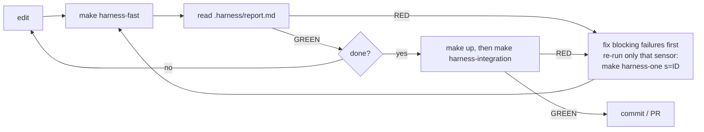

# 2. How to use air-harness

## 2.1 Requirements

| Tool | Version | Used for |
|---|---|---|
| Docker Engine | 26+ | everything runs in containers (volume `subpath` needs 26+) |
| Docker Compose | v2.24+ | the stack and the sensor containers |
| GNU make, bash, curl | any | entry points, smoke test |
| python3 + PyYAML | 3.11+ | only for the host-plane stages (`--check`, `--full`, `make harness-integration`) |

Every setting has a default. To change one: `cp .env.example .env` and edit (`./help.sh config` lists them).

## 2.2 Run it

```bash
./run.sh            # preflight → build + start → smoke test → every URL → next steps
./run.sh --check    # … then the harness: selftest, fast loop, unit + contract suite
./run.sh --full     # … --check plus the pipeline stage (search eval, alert rules) — what CI runs
./run.sh --llm      # also start a local LLM (Ollama) for the review agent
./run.sh --urls     # status and URLs of a running stack
./run.sh --down     # stop (data in DATA_DIR is kept; `make purge` deletes it)
```

After `./run.sh` you get:

| URL | What |
|---|---|
| http://localhost:8080 | public API (redirects to the docs) |
| http://localhost:8080/docs · `/redoc` · `/openapi.json` | interactive API docs, schema |
| http://localhost:8080/healthz · `/metrics` | gateway health, Prometheus metrics |
| http://localhost:9090 · `/targets` · `/alerts` | Prometheus |
| http://localhost:11434/v1 | local LLM (with `--llm`) |


Internal services (`content`, `search`, PostgreSQL, Kafka) have no host port by design; `run.sh` prints the
command to reach each one (e.g. `docker compose exec postgres psql -U postgres -d air_harness`).

**The portal.** http://localhost:8081 (`WEB_PORT`) is rag-web, the application's web client: Analyze (counts,
top tags and authors, topic map), Search (with tag and author facets), Graph (an explorer you expand by clicking
nodes), Chat (ask questions; answers cite the posts they come from, streamed), Write (publish and watch search, graph
and notify pick the post up), and a page per post, tag and author. Chat uses a local model after `./run.sh --llm`
(or `./app.sh up --llm`), any OpenAI-compatible endpoint set in `CHAT_LLM_URL`, or none: it then lists the posts.
It calls only the gateway, through the `web` service ([LLD](06-low-level-design.md#web-rag-web)).

**Sample data.** `./app.sh seed bank` loads 100 banking posts (loans, credit, debit, mortgages, cards, payments,
fraud, compliance, treasury) linked by 35 tags; `./app.sh seed general` loads 24 engineering posts. Both go through
the API and can be repeated safely; the portal's Analyze page offers the same datasets.

**Only the application.** `./app.sh` starts the RAG system alone (web, gateway, content, search, notify, graph and
their postgres, kafka, neo4j) with nothing from the harness: it needs only Docker and curl. `./app.sh test` runs
the contract suite, `./app.sh status | logs <service> | down` do the obvious, and `./app.sh export <dir>` writes
a standalone copy of the application (services, libs, db, infra, contract, compose) with no harness files, which
runs with the same `./app.sh`. CI runs that exported copy on every PR.

Try the API:

```bash
curl -s -XPOST localhost:8080/api/posts -H 'content-type: application/json' \
     -d '{"title":"Hello","body":"First post","author":"me"}'
curl -s localhost:8080/api/posts/1
curl -s 'localhost:8080/api/search?q=hello'
```

## 2.3 The loop — what you and the agent do on every change



`.harness/report.md` starts with the verdict (**GREEN** / **RED**), then:

1. **Blocking failures** — each with *How to fix*, the *Guides* that teach the rule, the sensor output, and the
   exact command to *re-run only this* sensor.
2. **Advisory findings** — judgement calls (review agent).
3. **Blind sensors** — harness problems (e.g. a configured LLM that is unreachable). Report them, do not work
   around them. **Skipped** sensors are not configured here (e.g. no LLM at all) — expected, and they say how to enable them.
4. **Warnings** — from sensors that passed.
5. **Not run in this stage yet** and **Passed**. Results from an older commit are marked *stale*.

## 2.4 Stages and make targets

| Stage | Command | What runs | Budget |
|---|---|---|---|
| pre-commit | `make harness-fast` | topology, migrations, ruff, semgrep (blocking) + review agent (advisory) | < 1 min, no network |
| | `make harness-static` | the blocking static part only (git hook, agent Stop hook) | seconds |
| integration | `make harness-integration` | unit tests + contract suite against the running stack | minutes |
| pipeline | `make harness-pipeline` | all of the above + search eval + alert-rule check | what CI runs |
| continuous | `make harness-continuous` | dead code, vulnerable dependencies | nightly |

Tools for trusting and steering the harness:

| Command | Purpose |
|---|---|
| `make harness-selftest` | every sensor fires on its seeded defects and stays quiet on clean fixtures |
| `make harness-selftest-live` | the same for the live-plane sensors: `deps-audit` (network) and, with an LLM configured, `review-agent` (seeded diffs breaking R3 and R4 must be flagged, a clean diff must not; SKIP without an LLM); CI runs it nightly |
| `make harness-selftest-host` | the same for the host-plane sensors, stack up: `prom-rules` (broken PromQL, bad durations), `eval` (a baseline the search misses must fail, a drop inside the tolerance must not), `unit` (mutants of `libs/common` — unverified signatures, ignored `TRUSTED_CALLERS`, no clock-skew check, a commit after a failed handler — must each turn a named test red), `contract` (a second gateway built from a mutant — author filter dropped, tag filter dropped, every upstream status turned into 200 — must fail a named contract test); `./run.sh --check` and CI run it |
| `make harness-coverage` | guide × sensor matrix: rules nobody checks, lessons nobody teaches, broken manifest entries |
| `make harness-stats` | from the ledger: what fires often (weak guide), never fires, is blind |
| `make harness-list` | every sensor with stage, plane, blocking flag, command |
| `make harness-one s=<id>` | re-run one sensor (falls back to the live container if needed) |
| `make harness-test` | lint + unit tests of the harness code itself |

Product commands: `make up`, `make down`, `make ps`, `make logs s=<service>`, `make test`, `make contract`,
`make eval`, `make llm`, `make clean`, `make purge`, `make help`.

## 2.5 Working with a coding agent

**Any agent.** The entry point is `AGENTS.md`. Skills in `harness/skills/<name>/SKILL.md` give step-by-step
procedures; `harness/review/RUBRIC.md` is what the reviewer checks.

**Next-step prompts.** Ready-to-paste prompts for the steps you will take, in order:

```bash
./help.sh prompts                               # list
./help.sh prompt 01                             # print one (paste into any agent)
claude "$(./help.sh prompt 01)"                 # Claude Code, interactive
./help.sh prompt 02 | claude -p                 # Claude Code, headless
./help.sh prompt task "Add rate limiting"       # generic task prompt with your task filled in
./help.sh prompt fix-red                        # the current RED report wrapped in a fix-only prompt
```

| # | Prompt | When |
|---|---|---|
| 01 | Get to know the repository | first session, nothing changes |
| 02 | First feature: list posts by author | watch the full loop, contract first |
| 03 | Schema change: tags on posts | migrations sensor and database rules |
| 04 | New service: notify | the topology sensor teaches the architecture |
| 05 | The harness is RED: fix only that | a report, the Stop hook or CI is RED |
| 06 | Review a change | before commit / PR |
| 07 | Ship | run what CI runs, write the PR |
| 08 | Improve the harness | maintainers |

**Claude Code** (wired in the repo): `CLAUDE.md` imports `AGENTS.md`; skills are exposed under `.claude/skills/`;
a **Stop hook** runs the static sensors when the agent tries to finish with uncommitted changes and sends it
back with the report while they are RED. It never blocks twice in a row, so a broken harness cannot trap it.

**git.** `git config core.hooksPath .githooks` runs the blocking static sensors before every commit.

**CI.** `.github/workflows/harness.yml` runs the harness self-tests and `./run.sh --full` on every PR and push
to `main`, and the continuous stage nightly. The report is attached to the job summary and as an artifact.

### The web console

`./run.sh --console` or `make console` (stack up) serves http://127.0.0.1:8090: an API playground generated from
the gateway's OpenAPI, buttons for every harness stage with live output, each sensor's latest result and selftest
verdict, the report, and an **Agent** tab. There you compose a prompt (a guided one, or the task template with
your task filled in) and either copy it or press **Run agent**: the console runs `AGENT_CMD "<prompt>"`
(default `claude -p --permission-mode acceptEdits`) in the repository and streams its output. The timeline next
to it shows every harness run from the ledger, including the ones the agent triggers through its Stop hook — the
loop, made visible. See the [demo](07-demo.md#7-the-web-console).

Claude Code applies this repository's pre-approved commands (`make harness-*`) only after the folder is trusted:
run `claude` in it once and accept the prompt. Settings: `CONSOLE_PORT`, `AGENT_CMD` (`.env.example`).

## 2.6 The review agent (optional LLM)

The review agent needs an OpenAI-compatible endpoint (Ollama, vLLM, a hosted API):

```bash
./run.sh --llm                          # local Ollama on :11434, pulls LLM_MODEL (default qwen3:8b)
# or in .env:
LLM_BASE_URL=https://your-endpoint/v1
LLM_MODEL=your-model
LLM_API_KEY=...
REVIEW_MODEL=a-stronger-model           # optional: review with a stronger model than you generate with
```

The review is **opt-in**: with `LLM_BASE_URL` empty (the default) it reports **SKIPPED**; with an endpoint that is
set but unreachable it reports **BLIND**. Neither ever blocks. `./run.sh --llm` turns it on for that run and tells you
the line to put in `.env` to keep it on.

## 2.7 Troubleshooting

| Symptom | Fix |
|---|---|
| Cannot connect to the Docker daemon | start Docker Desktop / `sudo systemctl start docker` |
| port is already allocated | set `GATEWAY_PORT` / `PROMETHEUS_PORT` in `.env` |
| a service is unhealthy or exited | `docker compose ps -a`, then `make logs s=<service>` |
| `migrate` exited with an error | a migration failed: never edit an applied one, add `V<next>__…sql` |
| volume `subpath` errors | Docker Engine 26+ / Compose 2.24+ required |
| `PermissionError` on `/out` | `.harness/` is owned by root from an old run: `sudo rm -rf .harness` |
| host plane needs PyYAML | `pip install pyyaml` |
| start from scratch | `make purge`, then `./run.sh` |

`./help.sh troubleshoot` prints the same list. Screenshots of every step: [Demo](07-demo.md).

Next: [Use cases](03-use-cases.md)
