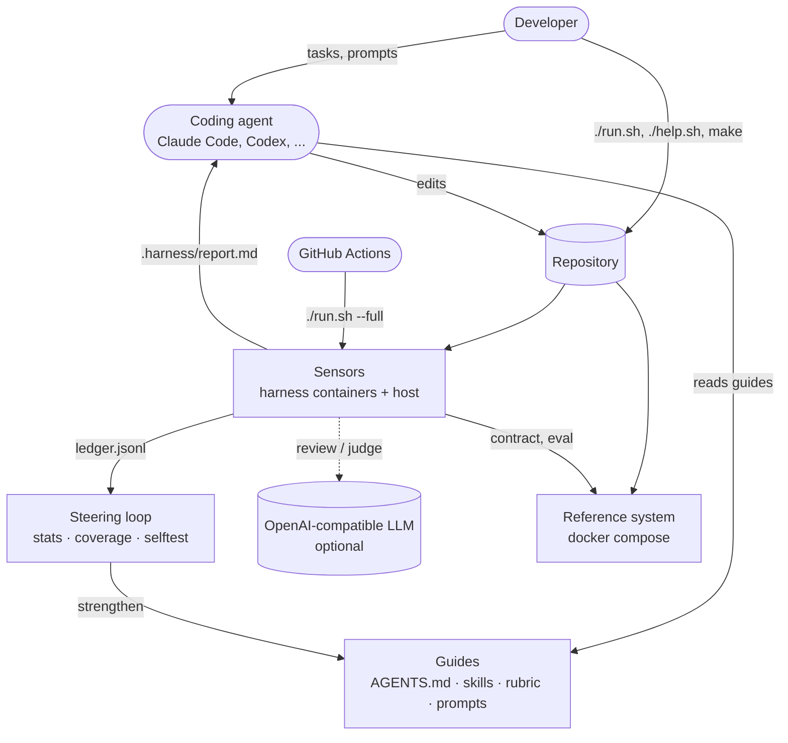
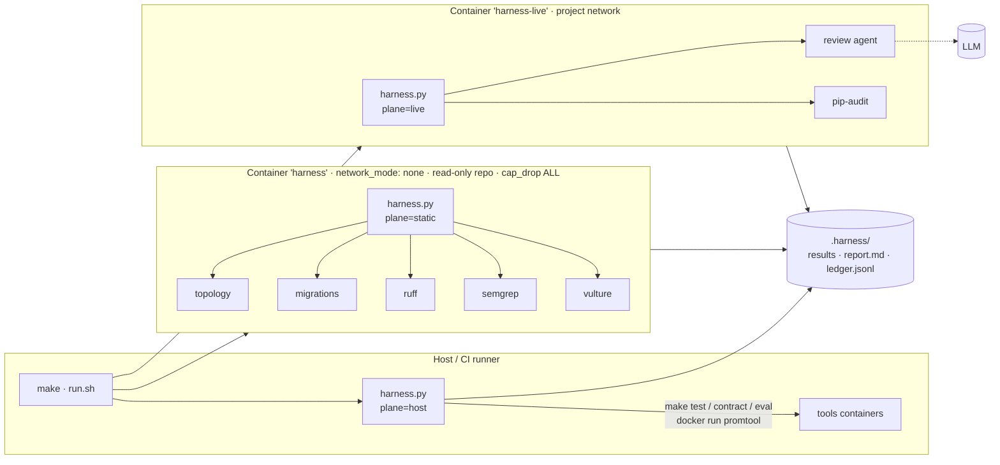
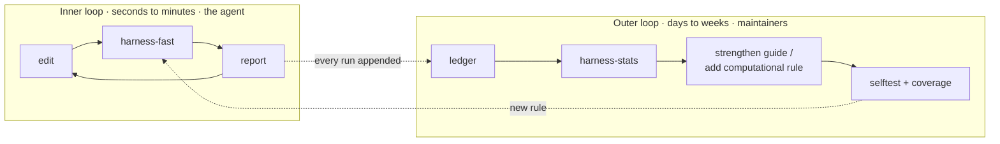
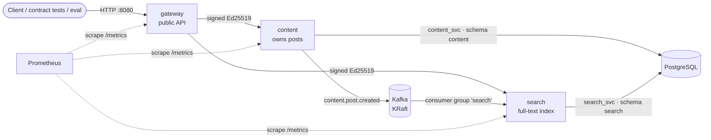
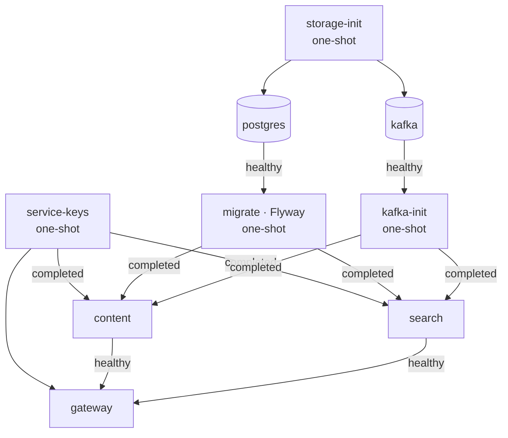

# 4. Implemented architecture

air-harness has two halves that live in one repository:

1. **The harness** — guides and sensors that regulate a coding agent.
2. **The reference system** — the application the harness regulates (gateway, content, search on PostgreSQL
   and Kafka). It exists so every sensor has real code to observe; in your own project it is replaced by your
   services.

## 4.1 System context

## 4.2 Harness architecture

### Planes — where a sensor runs

- **static** — hermetic and fast: no network, the repository mounted read-only, no Linux capabilities, a
  read-only root filesystem. The agent's code cannot phone home; sensors observe, they never edit.
- **live** — same image, on the project network: reaches the LLM and the running stack.
- **host** — the developer machine or CI runner, through `make` and `docker compose` (contract suite, eval,
  promtool).

All three planes write into one output directory; the runner merges the latest result of every sensor of the
stage into one report.

### Stages — when a sensor runs (keep quality left)

| Stage | Trigger | Sensors |
|---|---|---|
| pre-commit | every change (agent loop, git hook, Stop hook) | topology, migrations, ruff, semgrep-local · review-agent (advisory) |
| integration | before "done", stack up | unit, contract |
| pipeline | CI on every PR / push | static sensors + unit, contract, eval (advisory), prom-rules |
| continuous | nightly | dead-code, deps-audit (advisory) |

### The manifest is the architecture of the harness

`harness.yaml` declares 12 guides and 11 sensors. Each sensor has `kind`, `category`, `plane`, `stages`,
`blocking`, `run`, `pairs_with` (the guides that teach its rule), `fix_hint` and optionally `selftest`
(fixtures + command). The runner, the coverage matrix, the report and the steering statistics are all derived
from it.

### Feedback loops

## 4.3 Reference system architecture

### Containers and call graph

| Service | Responsibility | Exposed | Data | Trusts |
|---|---|---|---|---|
| gateway | public HTTP API; validates and forwards; holds no data | host `:8080` | — | (public) |
| content | creates and reads posts; publishes `content.post.created` | internal `:8000` | `content.posts` (role `content_svc`) | gateway |
| search | indexes events; full-text search with author filter | internal `:8000` | `search.documents` (role `search_svc`) | gateway |

### Cross-cutting decisions

| Concern | Decision | Enforced by |
|---|---|---|
| Service identity | one Ed25519 key per service, generated by the `service-keys` one-shot; each service mounts only its own private key | topology T2 |
| Authorization | callee accepts only callers in its `TRUSTED_CALLERS`; unsigned → 401, untrusted → 403 | topology T1, semgrep `unsigned-service-call`, contract `test_service_auth`, rubric R1 |
| Data ownership | each service has its own role and schema; no cross-schema reads | migrations M4, rubric R4 |
| Schema changes | Flyway only, append-only history; services own no DDL | migrations M1–M5, semgrep `ddl-outside-migrations` |
| Events | topics created by `kafka-init`, auto-create off; idempotent consumer, commit after write | topology T5, rubric R8 |
| Configuration | `${NAME:-default}` in compose + `.env.example` | topology T3, T8, rubric R5 |
| Persistence | under `DATA_DIR`, never in the repository | topology T9 |
| Observability | JSON logs with request id; `http_requests_total`, `http_request_duration_seconds`; alerts per service | topology T7, prom-rules |
| Supply chain | pinned image tags and package versions | topology T6, deps-audit |
| Behaviour | the contract suite is the specification | contract, rubric R2 |

### Deployment and startup order (docker compose)

Optional profiles: `observability` (Prometheus), `local-llm` (Ollama), `tools` (contract, unit, eval
containers). One-shots exit 0 and the dependents wait on `service_completed_successfully`.

### Security posture of the containers

Application services run as uid 10001 with `read_only: true`, `tmpfs: /tmp`, `cap_drop: [ALL]` and
`no-new-privileges`; only the gateway publishes a port. Sensor containers additionally run with the
invoking user's uid so reports are owned by the developer.

Next: [Components](05-components.md)
