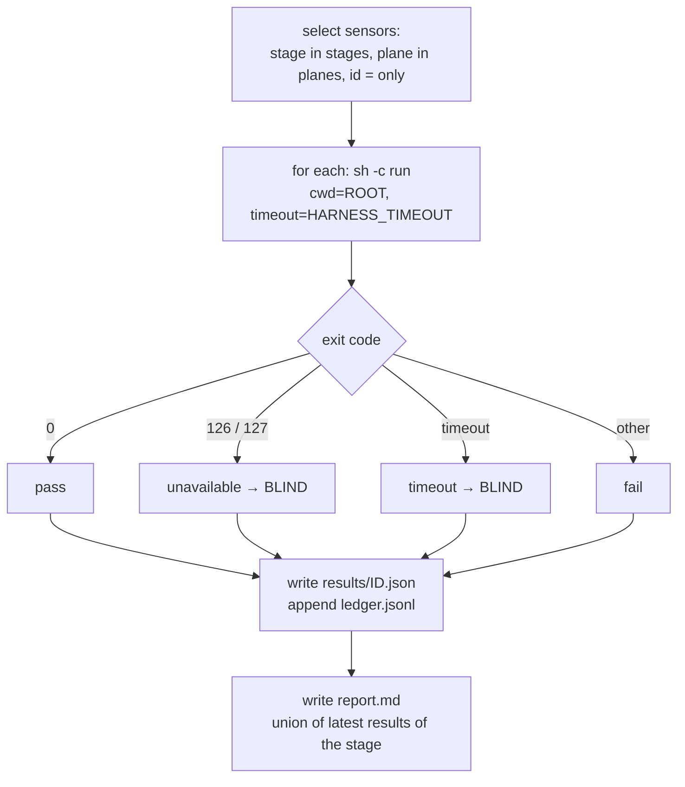
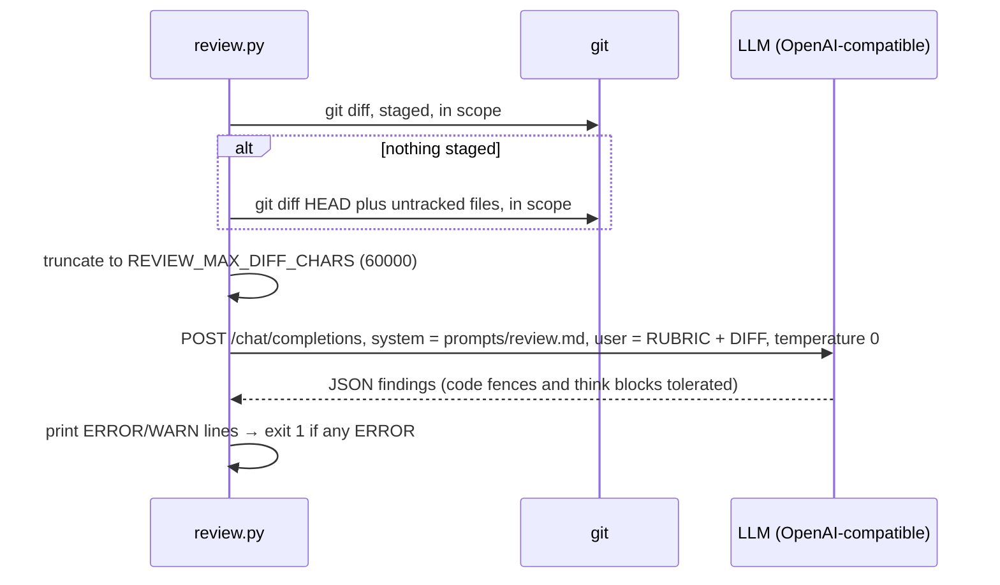
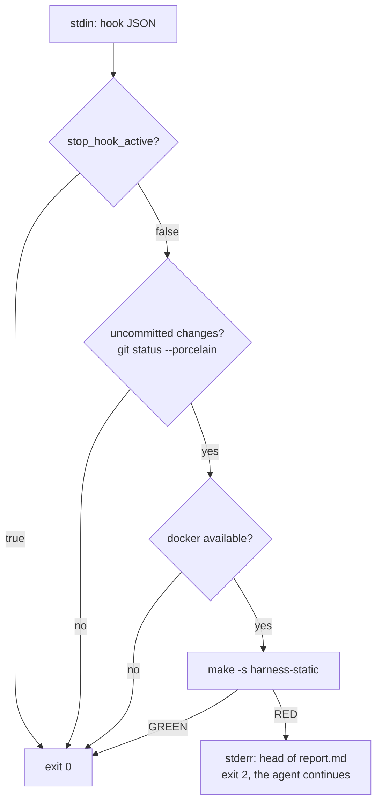
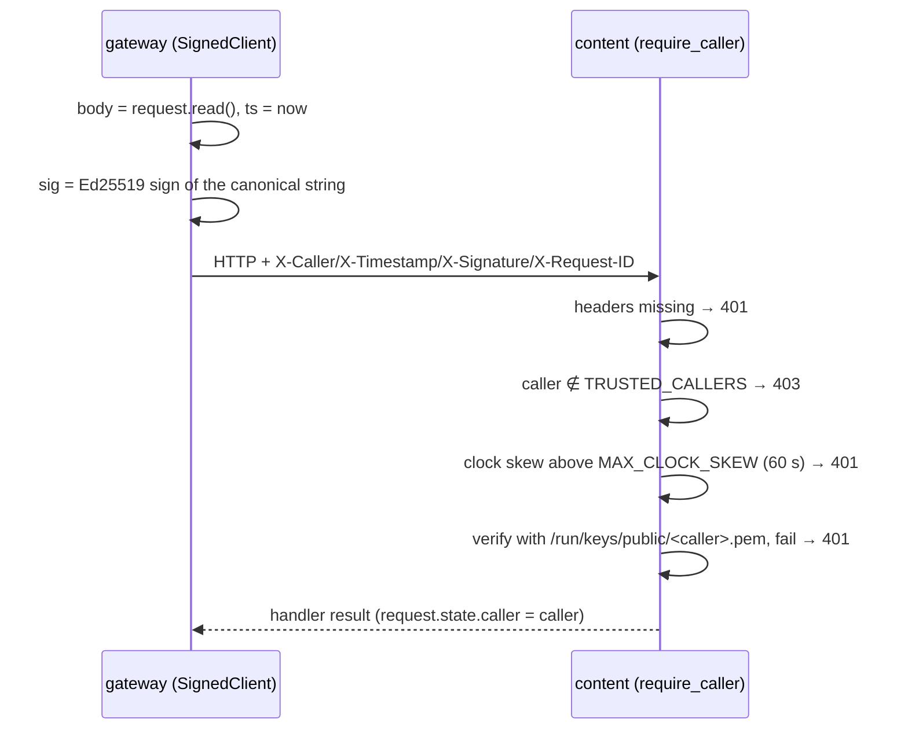
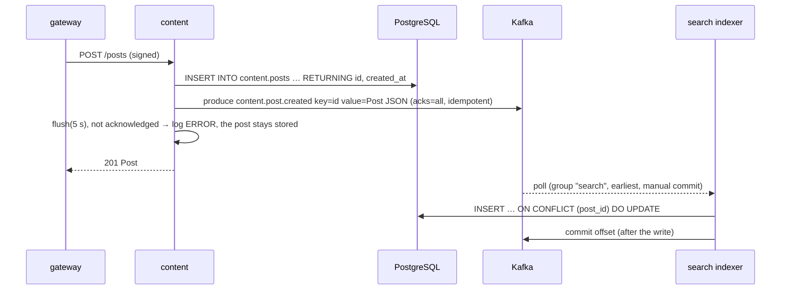
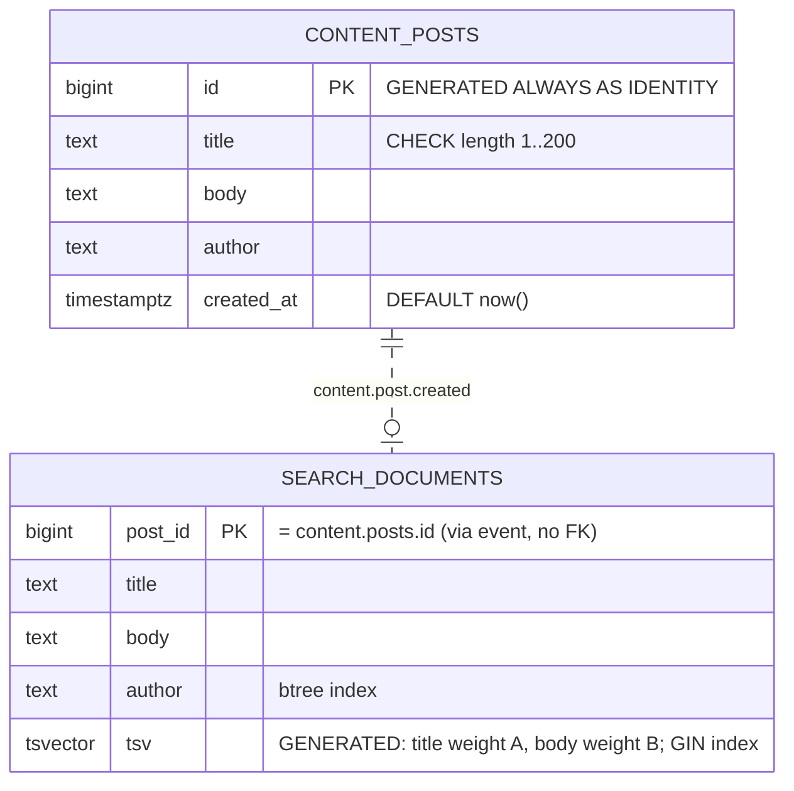
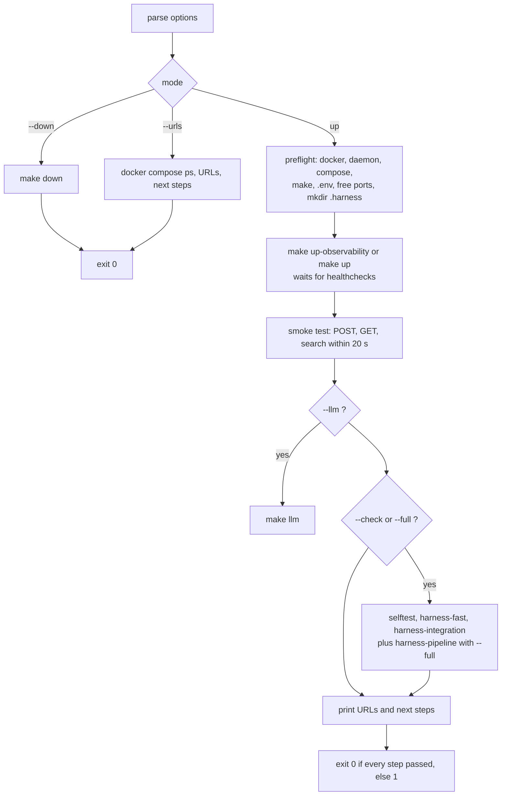

# 6. Low-level design

## 6.1 Runner (`harness/harness.py`)

Single file, standard library + PyYAML. The same script runs in the sensor containers and on the host.

### Configuration (environment)

| Variable | Default | Meaning |
|---|---|---|
| `HARNESS_ROOT` | `.` | repository root (`/work` in containers) |
| `HARNESS_OUT` | `$HARNESS_ROOT/.harness` | output directory (`/out` in containers) |
| `HARNESS_MANIFEST` | `harness.yaml` | manifest path relative to the root |
| `HARNESS_PLANE` | `all` | default `--plane` (`static` / `live` set by the containers) |
| `HARNESS_TIMEOUT` | `900` (300 in compose) | seconds per sensor command |
| `HARNESS_TAIL_LINES` | `60` | lines of sensor output kept per result |

### Verbs and exit codes

| Verb | Does | Exit codes |
|---|---|---|
| `run --stage S [--plane P] [--only ID]` | runs the selected sensors, writes results, ledger, report | 0 green · 1 a blocking sensor failed **or is blind** · 2 unknown `--only` id · 3 `--only` sensor belongs to another plane |
| `selftest [--only ID]` | runs every sensor's `selftest.run` on each fixture | 0 all fire / stay quiet · 1 a sensor is blind or noisy |
| `coverage` | guide × sensor matrix, consistency checks | 0 consistent · 1 problems |
| `stats [--min-runs N]` | steering table from the ledger (`N` default 20) | 0 |
| `list` | one line per sensor | 0 |

### Sensor execution



A sensor is **any command**. Contract: exit 0 = pass; 126/127 = cannot run (the runner reports BLIND, never a
code failure); anything else = fail. Findings are printed one per line starting with `ERROR` or `WARN`, followed
by indented `what:` / `fix:` lines. `WARN` lines (and their next two indented lines) of a *passing* sensor are
still surfaced in the report.

### Result file — `.harness/results/<id>.json`

```json
{"id": "topology", "status": "fail", "rc": 1, "seconds": 0.11, "rev": "cdbf004",
 "stage": "pre-commit", "plane": "static", "kind": "computational", "category": "architecture",
 "blocking": true, "ts": 1790966386,
 "output": "<last HARNESS_TAIL_LINES lines>", "warnings": ["WARN T6 ...\n      what: ...\n      fix: ..."]}
```

`status` ∈ `pass | fail | unavailable | timeout`. The **ledger** (`.harness/ledger.jsonl`) appends the same
record without `output` and `warnings`, one line per run.

### Report — `.harness/report.md`

Built from the latest result of every sensor declared for the stage (so the static and live containers, run
separately, produce one report):

1. Title: stage, current revision, verdict — **RED** if any blocking sensor failed or is blind, else **GREEN**.
2. *Blocking failures* — per sensor: kind, category, `fix_hint` (*How to fix*), paths of the paired guides,
   *Re-run only this* command (`make harness-one s=<id>` for container planes, the `python3 harness/harness.py …`
   command for the host plane), the output tail.
3. *Advisory findings* — same layout for non-blocking failures.
4. *Blind sensors* — status and the first 300 characters of output.
5. *Warnings* — WARN blocks of passing sensors.
6. *Not run in this stage yet* — declared sensors without a result (e.g. another plane).
7. *Passed*.

A result whose `rev` differs from the current revision is marked **stale**.

### Selftest

For each sensor with a `selftest` block, every entry of `selftest.fixtures` (files, or directories whose
expectation is in a `.expect` file) is run through `selftest.run` with `{fixture}` substituted.

| First line of the fixture | Passes when |
|---|---|
| `# expect: <text>` | exit code ∉ {0, 126, 127} **and** `<text>` appears in the output → `fires` |
| `# expect: clean` | exit code 0 → `quiet` |
| no expectation | exit code ∉ {0, 126, 127} |

Otherwise the line is `BLIND` / `NOISY` and the verb exits 1. Fixtures are excluded from normal linting
(`pyproject.toml` `extend-exclude`).

### Coverage checks

Problems (exit 1): `MISSING` guide path or selftest fixtures · `BAD` unknown kind/category/stage/plane ·
`DANGLING` `pairs_with` to an unknown guide · `DUP` duplicate sensor id · `GAP` a category without any sensor.
Information: `FF-ONLY` guide no sensor checks · `FB-ONLY` sensor no guide teaches · `RISK` inferential and
blocking · `UNPROVEN` static computational sensor without seeded defects.

### Stats — steering hints

Per sensor: runs, fired (= failed), rate, blind, average seconds. Hint order: *blind > 20 %* → fix the
environment; *rate > 30 %* → strengthen the paired guide; *never fired in ≥ `--min-runs` runs* → run selftest,
demote or remove.

## 6.2 Manifest schema (`harness.yaml`)

```yaml
harness: 1
template: { name: py-services-pg-kafka, version: 0.2.0 }
categories: [maintainability, architecture, behaviour]
guides:
  - id: <unique>                 # referenced by sensors.pairs_with
    path: <file or directory>    # must exist (coverage)
    kind: computational | inferential
    category: [<category>, ...]
sensors:
  - id: <unique>
    kind: computational | inferential
    category: <category>
    plane: static | live | host
    stages: [pre-commit | integration | pipeline | continuous, ...]
    blocking: true | false       # default true
    run: <shell command, cwd = repo root>
    pairs_with: [<guide id>, ...]
    fix_hint: <one line shown in the report>
    selftest:                    # optional
      fixtures: <directory>
      run: <command with {fixture}>
```

## 6.3 Sensor containers (`compose.harness.yml`, `harness.mk`)

Both services use `image: ${HARNESS_IMAGE:-air-harness-runner:0.2.0}`, profile `harness`,
`user: ${HARNESS_UID}:${HARNESS_GID}` (set by make to the invoking user), `read_only: true`, `tmpfs: /tmp`,
`cap_drop: [ALL]`, `no-new-privileges`, the repository at `/work:ro` and `./.harness` at `/out`.

| Service | Network | Extra environment |
|---|---|---|
| `harness` | `network_mode: none` | `HARNESS_PLANE=static`, `MIGRATIONS_BASE` |
| `harness-live` | project network + `host.docker.internal` | `HARNESS_PLANE=live`, `LLM_*`, `REVIEW_MODEL`, `REVIEW_DIFF_BASE` |

Every container target has the order-only prerequisite `| $(OUT_DIR)`, which creates `.harness/` as the
invoking user *before* docker would create the bind-mount source as root. `harness-one` runs the sensor in
`harness`; on exit code 3 (other plane) it re-runs it in `harness-live`.

## 6.4 Topology sensor (`topology_check.py`)

Input: a compose file (`--strict` makes warnings fail, used by selftest). Parses YAML with `SafeLoader`
(so `<<` merges are resolved and `depends_on` is the effective one) and scans the raw text for variables
(comments stripped). Paths for T7/T8 come from the compose file itself: `x-harness: {alerts, env_example}`.
Services in a dev profile (`TOPOLOGY_DEV_PROFILES`, default `admin,local-llm,e2e,tools`) are tooling and are
skipped by T1, T4–T7, T9.

| Rule | Severity | Check |
|---|---|---|
| T1 caller-trusted | ERROR | for every `http(s)://<svc>:<port>` in a service's env (defaults resolved): if `<svc>` has `TRUSTED_CALLERS`, the caller must be in it |
| T2 key-provisioned | ERROR / WARN | key subpaths mounted from `service-keys` must be in the `service-keys` entrypoint list (after `/keys`); every trusted caller must have a key; a caller must mount its own key; WARN if a service signs as another identity |
| T3 default-drift | ERROR / WARN | one variable, one default; WARN when `:-` and `-` are mixed |
| T4 migrate-first | ERROR | a service with `DB_DSN` depends on `migrate` |
| T5 topics-first | WARN | a service with `KAFKA_BOOTSTRAP` depends on `kafka-init` |
| T6 pinned-images | WARN | no untagged / `:latest` images; flags frozen registries (`bitnamilegacy/`) |
| T7 alerts-present | ERROR | every long-running (`restart` set), built, profile-less service has `job="<name>"` in the alerts file |
| T8 env-documented | ERROR | every `${VAR}` read by compose is a `VAR=` line in the env example |
| T9 data-outside-repo | ERROR | no writable bind mount from the repository (`./…`) |

Output format: `SEV  RULE  location` / `what:` / `fix:`; last line `topology: N services, E errors, W warnings`.

## 6.5 Migrations sensor (`migrations_check.py`)

| Rule | Severity | Check |
|---|---|---|
| M1 naming | ERROR | file name matches `^(V<n>|R)__<snake_case>.sql$` (dotfiles ignored) |
| M2 unique-version | ERROR | each `V<n>` once |
| M3 append-only | ERROR | `git diff --name-status $MIGRATIONS_BASE -- <dir>` shows no `M`/`D` for a `V` file (default base `HEAD`; CI: `origin/main`; skipped outside git) |
| M4 granted | ERROR | every `CREATE TABLE x` has a `GRANT … ON x TO …` in the same file (comments stripped; grant lists split on commas) |
| M5 no-gaps | WARN | versions 1…max are contiguous |

## 6.6 Review sensor (`review.py`)



Scope: `services libs db contract docker-compose.yml infra`. `REVIEW_DIFF_BASE` set → `git diff <base>`.
Unreachable endpoint or a reply without a JSON object → exit 127 (BLIND). `LLM_NO_THINK=true` sends
`chat_template_kwargs.enable_thinking=false` (ignored by servers that do not support it). Finding schema:
`{severity: ERROR|WARN, rule, file, line, what, fix}`.

## 6.7 Stop hook (`harness/hooks/agent-stop.sh`)



## 6.8 Signed service-to-service calls (`libs/common/common/service_auth.py`)

**Keys.** `service-keys` runs `python -m common.keygen /keys gateway content search` as root: per service
`/keys/<name>/private.pem` (PKCS#8 Ed25519, mode 0400, owner uid 10001, directory 0500) and
`/keys/public/<name>.pem` (0444). Idempotent: existing keys are kept. Each service mounts
`subpath: <name>` at `/run/keys/self` and `subpath: public` at `/run/keys/public`, read-only.

**Canonical string and headers.**

```
canonical = METHOD + "\n" + PATH[?QUERY] + "\n" + UNIX_TIMESTAMP + "\n" + hex(SHA-256(body))
X-Caller:    <service name>
X-Timestamp: <unix seconds>
X-Signature: base64(Ed25519.sign(private_key, canonical))
X-Request-ID: <propagated request id>
```



The verifier caches public keys per caller; `/healthz` and `/metrics` are not protected. Known limit: no nonce
store, so a captured request can be replayed inside the skew window (internal network only).

## 6.9 Telemetry (`libs/common/common/telemetry.py`)

`create_app(service, **fastapi_kwargs)`:

- JSON log lines on stdout: `ts, level, service, logger, msg, request_id[, exc]`; level from `LOG_LEVEL`;
  uvicorn access log disabled.
- Middleware: request id from `X-Request-ID` or a new UUID, echoed in the response; metrics per *route
  template* (`/api/posts/{post_id}`, unmatched → `unmatched`); `/metrics` and `/healthz` excluded.
- `http_requests_total{service,method,route,status}` (counter),
  `http_request_duration_seconds{service,method,route}` (histogram).
- `GET /healthz` → `{"status":"ok","service":…}`; `GET /metrics` → Prometheus text format.

## 6.10 Services

### Public API (gateway)

| Method | Path | Parameters | Forwards to | Responses |
|---|---|---|---|---|
| GET | `/` | — | — | 307 → `/docs` |
| POST | `/api/posts` | JSON body (object) | content `POST /posts` | 201 post · 422 validation · 502 upstream down |
| GET | `/api/posts/{post_id}` | `post_id: int` | content `GET /posts/{id}` | 200 · 404 · 422 · 502 |
| GET | `/api/search` | `q` 1–200 chars, `author?`, `limit` 1–50 (10) | search `GET /search` | 200 `{query, hits[]}` · 422 · 502 |

### content

`PostIn`: `title` 1–200, `body` 1–20000, `author` 1–64 matching `^[A-Za-z0-9._-]+$`.
`Post` = `PostIn` + `id: int`, `created_at: datetime`.



Event `content.post.created` (3 partitions): key = post id, value =
`{"id", "title", "body", "author", "created_at"}`. Only additive changes; a breaking change needs a new topic.

### search

- **Indexer** (thread): malformed event → logged and skipped (offset committed); database error → seek back
  to the same offset, wait 2 s, retry. At-least-once + upsert = effectively once.
- **Query:** `websearch_to_tsquery('english', q)` against `tsv`; rank `ts_rank_cd`; order `score DESC, post_id
  DESC`; optional `author =` filter; `LIMIT` 1–50 (default 10).

## 6.11 Database (`db/migrations`)

| Migration | Content |
|---|---|
| `V1__service_roles.sql` | roles `content_svc`, `search_svc` (`LOGIN`, password from Flyway placeholders `${content_db_password}`, `${search_db_password}`); `REVOKE CREATE ON SCHEMA public FROM PUBLIC` |
| `V2__content_posts.sql` | schema `content`; `content.posts` |
| `V3__search_documents.sql` | schema `search`; `search.documents` + indexes |



Grants: `content_svc` → `USAGE` on `content`, `SELECT, INSERT` on `content.posts`. `search_svc` → `USAGE` on
`search`, `SELECT, INSERT, UPDATE` on `search.documents`. Objects are owned by the migration user (`postgres`).
The `migrate` one-shot runs Flyway with `FLYWAY_CONNECT_RETRIES=30`; the placeholders come from
`CONTENT_DB_PASSWORD` / `SEARCH_DB_PASSWORD`, the same variables used in each service's `DB_DSN`.

## 6.12 Eval (`eval/run_eval.py`)

1. Load `corpus.yaml` (`version`, `docs[key,title,body]`, `queries[q, relevant[]]`).
2. Author `eval-<version>`; if the corpus is not yet indexed, create every doc through `POST /api/posts`; wait up
   to 60 s until all titles are found (indexing is asynchronous).
3. Per query: `GET /api/search?q=…&author=…&limit=10`; map hit ids to doc keys.
   - recall@5 = |relevant ∩ top-5| / |relevant|
   - RR = 1 / rank of the first relevant hit (0 if none); MRR@10 = mean RR
   - judge (optional, `JUDGE_BASE_URL`): the top hit graded 0–3 with `harness/prompts/judge.md`;
     judge@1 = Σ grades / (3 · judged)
4. Regression = metric < baseline − `EVAL_TOLERANCE` (0.05) → exit 1.
5. Writes `$EVAL_OUT/eval-results.json` (promote to `eval/baseline.json` deliberately) and `eval-report.md`.

## 6.13 `run.sh`



URL values come from the environment, then `.env`, then defaults (`PUBLIC_HOST`, `GATEWAY_PORT`,
`PROMETHEUS_PORT`, `OLLAMA_PORT`). Only running services are listed as reachable.

## 6.14 CI (`.github/workflows/harness.yml`)

Triggers: pull requests, pushes to `main`, nightly (03:17 UTC), manual. One job on `ubuntu-latest`:
checkout (full history) → setup-python 3.12 + PyYAML, `DATA_DIR=$RUNNER_TEMP/air-harness-data` →
`make harness-build` → `make harness-test`, `harness-coverage`, `harness-selftest` → `make harness-static` →
nightly: `make harness-continuous`; otherwise `./run.sh --full` → report and eval report into the job summary →
service logs on failure → `.harness/` as an artifact → `make clean`. `MIGRATIONS_BASE` is
`origin/<base branch>` on pull requests and `HEAD~1` on pushes.

## 6.15 Configuration reference

All variables have defaults in `docker-compose.yml` / `compose.harness.yml` and are listed in `.env.example`
(topology T8 enforces it). Main ones:

| Variable | Default | Purpose |
|---|---|---|
| `DATA_DIR` | `/var/tmp/air-harness` | persistent data (postgres, kafka, ollama) |
| `GATEWAY_PORT` / `PROMETHEUS_PORT` / `OLLAMA_PORT` | 8080 / 9090 / 11434 | host ports |
| `POSTGRES_DB`, `POSTGRES_PASSWORD` | `air_harness`, `postgres-dev` | database |
| `CONTENT_DB_PASSWORD`, `SEARCH_DB_PASSWORD` | `content-dev`, `search-dev` | service roles |
| `LOG_LEVEL` | `INFO` | services |
| `KAFKA_HEAP_OPTS` | `-Xmx512m -Xms256m` | broker heap |
| `*_TAG` | pinned | image versions |
| `LLM_BASE_URL`, `LLM_MODEL`, `LLM_API_KEY`, `REVIEW_MODEL`, `LLM_NO_THINK` | host Ollama, `qwen3:8b` | review agent |
| `REVIEW_DIFF_BASE` | empty | what the reviewer reviews |
| `EVAL_TOLERANCE`, `JUDGE_BASE_URL`, `JUDGE_MODEL`, `JUDGE_API_KEY` | 0.05, empty | eval |
| `HARNESS_IMAGE`, `HARNESS_TIMEOUT`, `MIGRATIONS_BASE` | runner 0.2.0, 300, `HEAD` | harness |
| `PUBLIC_HOST` | `localhost` | host name printed by `run.sh` |

Back to the [documentation index](../README.md).
