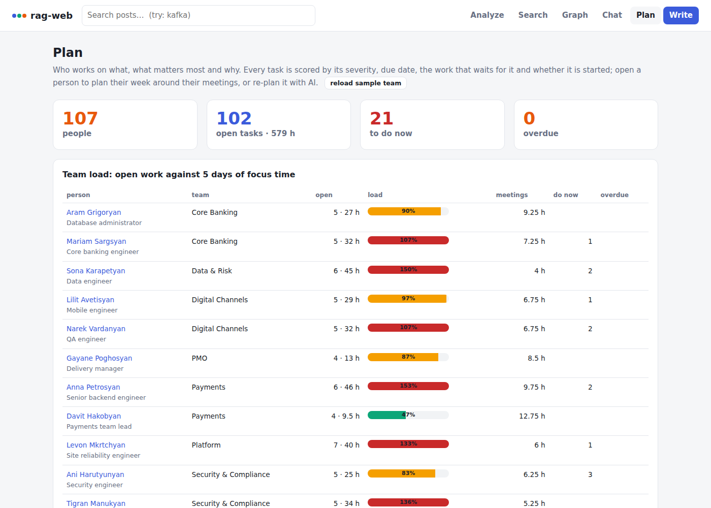

# 8. Planner: employees, tasks, meetings, and an AI re-plan

The `planner` service plans the work of a bank's IT staff. It keeps employees, their Jira-style tasks
(title, description, severity, status, estimate, due date, dependencies) and their Outlook-style meetings. It
scores every task by what makes it important, and it fills each person's working week around their meetings. On
request, a language model re-orders a person's tasks following a plain-language instruction. The rules then
check the model's answer, so a model can change what comes first but can never break a dependency or overfill a day.



## Try it

```bash
./app.sh up --llm          # or ./app.sh up: without a model the re-plan returns the rules' plan
./app.sh seed planner      # 11 employees in 7 teams, 61 tasks, 57 meetings; dates relative to today
open http://localhost:8081/#/plan
```

The portal's **Plan** page can also load the same team with **Load the iBank IT team**. Seeding again moves the demo
to the current week and resets the tasks' status: employees, tasks and meetings are upserted by handle, key and id.

## Priority: why a task matters

Every task gets a score, a bucket and the reasons for both, which the portal shows next to the task.

| Signal | Points |
|---|---|
| severity | blocker 100 · critical 60 · major 30 · minor 10 · trivial 3 |
| due date | overdue +80 · today +60 · in 1–2 days +40 · in 3–5 days +20 · in 6–10 days +8 |
| work waiting for it | +15 for each open task that depends on it (at most 3); +10 more if one of them is blocker or critical |
| progress | in progress +10 · in review +5 |

Buckets: **do now** ≥ 90, **next** ≥ 50, **later** ≥ 20, otherwise **someday**. `blocked_by` lists the
open tasks it waits for, and `blocks` lists the tasks waiting for it. Done tasks keep a score but sort last.

## Schedule: a person's week

- Working days are Monday to Friday, 09:00–18:00, with lunch from 13:00 to 14:00. Meetings are on the office's wall clock (no time zone).
- Each day holds at most `capacity_hours` of task work (focus hours; meetings come on top).
- Tasks go in the given order: by default the rules' order (score, then due date). A task starts only when its own
  open dependencies are finished in the plan. Tasks are cut into chunks of at least 30 minutes, and estimates are rounded to quarter hours.
- A dependency owned by someone else does not hold the task back, but the plan warns about it (`waits for CORE-210 (todo, @aram)`).
- Warnings cover:
  - a task that finishes after its due date;
  - days with 5 h or more of meetings;
  - work that does not fit in the plan;
  - meetings booked on a day off.

  Work that does not fit is listed under `unscheduled` with the reason.

## AI re-plan

`POST /api/planner/plan/{handle}/ai {"instruction": "I am off on Friday; security first", "days": 5}`

1. The planner sends the model:
   - the person;
   - the plan's days with their meeting hours;
   - every open task with its rule score, severity, status, estimate, due date, dependencies and description;
   - the instruction.
2. The model answers with JSON: `order` (every key once), `notes` (why a task is where it is), `days_off`
   (plan dates the instruction frees), and `summary`.
3. The answer is read strictly:
   - unknown keys are dropped;
   - missing keys are appended in the rules' order;
   - days off must be days of the plan.

   The same scheduler then fills the week with the model's order, so dependencies, meetings and capacity still hold.
4. `source` is `model` (with `model`, `notes`, `days_off`, `changed`: how many positions moved). Without a usable
   answer, `source` is `rules` and `fallback` says why: no model configured, the model is unreachable, or its answer was not valid JSON.

The model is the chat's endpoint (`CHAT_LLM_URL`, `CHAT_MODEL`, `CHAT_LLM_API_KEY`). It is reached only through
`common.llm.ChatModel`, as every model call in this system is.


## Work graph

`GET /api/planner/graph` returns:

- people (`e:<handle>`);
- their most important open tasks (`t:<key>`, with severity, status, score and bucket);
- `assigned` edges (person → task) and `depends_on` edges (task → task);
- `meets` edges between people, weighted by their shared meetings in the next 5 working days.

With `handle`, the graph holds that person's tasks, the tasks they wait for and the tasks waiting for them. The portal
draws it with the same force-directed graph as the knowledge graph. This graph is computed from Postgres on request; it is not stored in Neo4j.

## API (gateway)

| Method and path | What it does |
|---|---|
| `POST /api/planner/employees` | add or update an employee: `handle`, `name`, `role`, `team`, `capacity_hours` (0–10, default 6) |
| `GET /api/planner/employees?team=&start=` | everyone (or a team) with their load: `open_tasks`, `open_hours`, `overdue`, `urgent`, `meeting_hours` (next 5 working days), `load` (open hours ÷ 5 days of focus) |
| `POST /api/planner/tasks` | add or update a task: `key` (`PAY-101`), `title`, `description`, `severity`, `status`, `assignee`, `estimate_hours`, `due`, `depends_on`; 422 for an unknown assignee or a self-dependency |
| `GET /api/planner/tasks?assignee=&severity=&status=&project=&q=&sort=&start=&limit=` | tasks with `score`, `bucket`, `reasons`, `blocked_by`, `blocks`. `status` is `open` or a single status; `severity` may repeat; `sort` is `priority`, `due`, `severity`, `estimate` or `key` |
| `GET /api/planner/tasks/{key}` · `POST /api/planner/tasks/{key}/status` | one task; move it to `todo`, `in_progress`, `review` or `done` |
| `POST /api/planner/meetings` · `GET /api/planner/meetings?attendee=&start=&days=` | add or update a meeting (`id`, `title`, `starts_at`, `ends_at`, `organizer`, `attendees`); list them |
| `GET /api/planner/plan/{handle}?start=&days=` | the rules' plan: `order`, `tasks`, `days` (meetings and scheduled items), `unscheduled`, `warnings`, `finishes`, `summary` |
| `POST /api/planner/plan/{handle}/ai` | the model's re-plan, checked by the rules (above) |
| `GET /api/planner/graph?handle=&team=&start=&limit=` | the work graph |

`start` (a date) replaces "today" and makes every answer reproducible; the contract tests use a fixed Monday.

## Where it lives

| Part | Files |
|---|---|
| service | `services/planner/app.py` (API, Postgres), `planning.py` (priority, schedule, prompt and answer reader: pure functions) |
| tests | `services/planner/tests/test_planning.py` (unit, `make test`), `contract/test_planner.py` (API) |
| schema | `db/migrations/V9__planner.sql`: role `planner_svc`, schema `planner`, tables `employees`, `tasks`, `meetings` |
| wiring | compose `planner` (trusts `gateway`, own key, `PLANNER_DB_PASSWORD`), gateway routes `/api/planner/*`, Prometheus job and alerts |
| data | `services/web/static/datasets/planner.json` (seeded by `tools/seed.py`, or by the portal) |
| portal | `services/web/static/app.js`: `pagePlan` (team load, task filters, work graph), `pagePerson` (week, order of work, AI re-plan, status changes) |

Back to the [documentation index](../README.md) · previous: [Demo](07-demo.md)
