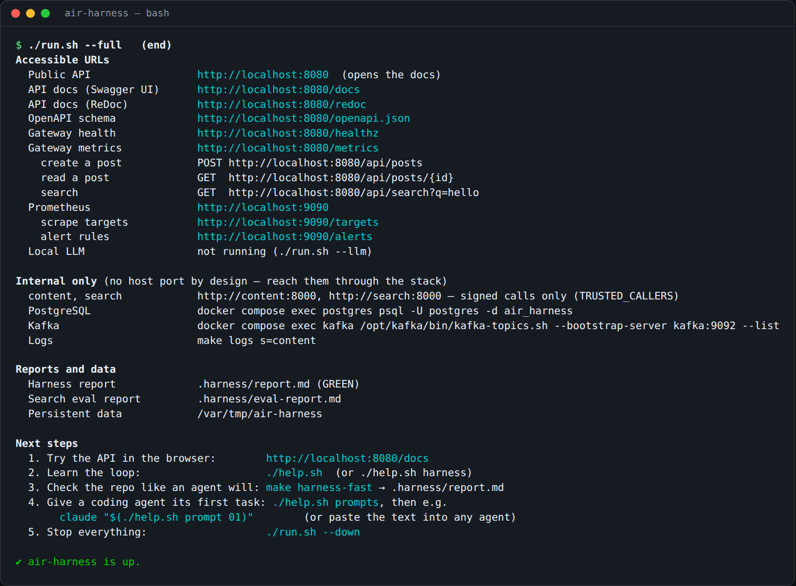
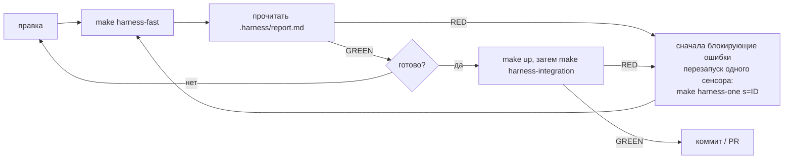

# 2. Как пользоваться air-harness

## 2.1 Требования

| Инструмент | Версия | Для чего |
|---|---|---|
| Docker Engine | 26+ | всё работает в контейнерах (для `subpath` у томов нужен 26+) |
| Docker Compose | v2.24+ | стенд и контейнеры сенсоров |
| GNU make, bash, curl | любая | точки входа, smoke-тест |
| python3 + PyYAML | 3.11+ | только для стадий на плоскости host (`--check`, `--full`, `make harness-integration`) |

У каждой настройки есть значение по умолчанию. Чтобы изменить: `cp .env.example .env` и отредактировать
(`./help.sh config` выводит список).

## 2.2 Запуск

```bash
./run.sh            # проверка окружения → сборка и старт → smoke-тест → все адреса → следующие шаги
./run.sh --check    # … плюс harness: selftest, быстрый цикл, unit- и контрактные тесты
./run.sh --full     # … --check плюс стадия pipeline (оценка поиска, правила алертов) — то, что запускает CI
./run.sh --llm      # дополнительно поднять локальную LLM (Ollama) для агента-ревьюера
./run.sh --urls     # статус и адреса запущенного стенда
./run.sh --down     # остановить (данные в DATA_DIR сохраняются; `make purge` удаляет их)
```

После `./run.sh` доступны:

| Адрес | Что это |
|---|---|
| http://localhost:8080 | публичный API (перенаправляет на документацию) |
| http://localhost:8080/docs · `/redoc` · `/openapi.json` | интерактивная документация API, схема |
| http://localhost:8080/healthz · `/metrics` | здоровье gateway, метрики Prometheus |
| http://localhost:9090 · `/targets` · `/alerts` | Prometheus |
| http://localhost:11434/v1 | локальная LLM (с `--llm`) |



У внутренних сервисов (`content`, `search`, PostgreSQL, Kafka) намеренно нет порта на хосте; `run.sh` выводит
команду для доступа к каждому (например, `docker compose exec postgres psql -U postgres -d air_harness`).

Попробуйте API:

```bash
curl -s -XPOST localhost:8080/api/posts -H 'content-type: application/json' \
     -d '{"title":"Hello","body":"First post","author":"me"}'
curl -s localhost:8080/api/posts/1
curl -s 'localhost:8080/api/search?q=hello'
```

## 2.3 Цикл — что вы и агент делаете при каждом изменении



`.harness/report.md` начинается с вердикта (**GREEN** / **RED**), затем:

1. **Блокирующие ошибки** — у каждой: *How to fix* (как исправить), *Guides* (гайды, которые учат этому
   правилу), вывод сенсора и точная команда, чтобы *перезапустить только этот* сенсор.
2. **Рекомендательные замечания** — вопросы суждения (агент-ревьюер, eval).
3. **Слепые сенсоры** — проблемы harness (например, нет LLM). Сообщите о них, не обходите их.
4. **Предупреждения** — от сенсоров, которые прошли.
5. **Ещё не запускались на этой стадии** и **Прошли**. Результаты от более старого коммита помечаются *stale*.

## 2.4 Стадии и цели make

| Стадия | Команда | Что запускается | Бюджет |
|---|---|---|---|
| pre-commit | `make harness-fast` | topology, migrations, ruff, semgrep (блокирующие) + агент-ревьюер (рекомендательный) | < 1 мин, без сети |
| | `make harness-static` | только блокирующая статическая часть (git-хук, Stop-хук агента) | секунды |
| integration | `make harness-integration` | unit-тесты + контрактные тесты против запущенного стенда | минуты |
| pipeline | `make harness-pipeline` | всё выше + оценка поиска + проверка правил алертов | то, что запускает CI |
| continuous | `make harness-continuous` | мёртвый код, уязвимые зависимости | ночью |

Инструменты доверия к harness и управления им:

| Команда | Назначение |
|---|---|
| `make harness-selftest` | каждый сенсор срабатывает на своих засеянных дефектах и молчит на чистых фикстурах |
| `make harness-coverage` | матрица гайды × сенсоры: правила без проверки, уроки без учителя, сломанные записи манифеста |
| `make harness-stats` | по журналу: что срабатывает часто (слабый гайд), что никогда, что слепо |
| `make harness-list` | все сенсоры: стадия, плоскость, блокирует ли, команда |
| `make harness-one s=<id>` | перезапуск одного сенсора (при необходимости — в live-контейнере) |
| `make harness-test` | линтер и unit-тесты кода самого harness |

Команды продукта: `make up`, `make down`, `make ps`, `make logs s=<service>`, `make test`, `make contract`,
`make eval`, `make llm`, `make clean`, `make purge`, `make help`.

## 2.5 Работа с агентом

**Любой агент.** Точка входа — `AGENTS.md`. Навыки в `harness/skills/<name>/SKILL.md` дают пошаговые процедуры;
`harness/review/RUBRIC.md` — то, что проверяет ревьюер.

**Промпты «следующих шагов».** Готовые к вставке промпты для шагов, которые вы будете делать, по порядку:

```bash
./help.sh prompts                               # список
./help.sh prompt 01                             # вывести один (вставить в любого агента)
claude "$(./help.sh prompt 01)"                 # Claude Code, интерактивно
./help.sh prompt 02 | claude -p                 # Claude Code, без интерфейса
./help.sh prompt task "Add rate limiting"       # общий промпт задачи с подставленной задачей
./help.sh prompt fix-red                        # текущий RED-отчёт в промпте «исправь только это»
```

| № | Промпт | Когда |
|---|---|---|
| 01 | Знакомство с репозиторием | первая сессия, ничего не меняется |
| 02 | Первая фича: посты по автору | увидеть полный цикл, контракт сначала |
| 03 | Изменение схемы: теги у постов | сенсор миграций и правила БД |
| 04 | Новый сервис: notify | сенсор топологии учит архитектуре |
| 05 | Harness RED: исправить только это | отчёт, Stop-хук или CI красные |
| 06 | Ревью изменения | перед коммитом / PR |
| 07 | Выпуск | прогнать то же, что CI, написать PR |
| 08 | Улучшить harness | для мейнтейнеров |

Сами промпты написаны на английском — это язык, на котором работают агенты и код; при желании их можно
перевести, не меняя структуру.

**Claude Code** (подключён в репозитории): `CLAUDE.md` импортирует `AGENTS.md`; навыки доступны в
`.claude/skills/`; **Stop-хук** запускает статические сенсоры, когда агент пытается завершить работу с
незакоммиченными изменениями, и возвращает его к отчёту, пока они красные. Он никогда не блокирует дважды
подряд, поэтому сломанный harness не может «запереть» агента.

**git.** `git config core.hooksPath .githooks` запускает блокирующие статические сенсоры перед каждым коммитом.

**CI.** `.github/workflows/harness.yml` запускает самотесты harness и `./run.sh --full` на каждый PR и push в
`main`, а ночью — стадию continuous. Отчёт прикрепляется к сводке джоба и как артефакт.

## 2.6 Агент-ревьюер (опциональная LLM)

Агенту-ревьюеру нужен OpenAI-совместимый эндпоинт (Ollama, vLLM, облачный API):

```bash
./run.sh --llm                          # локальная Ollama на :11434, скачивает LLM_MODEL (по умолчанию qwen3:8b)
# или в .env:
LLM_BASE_URL=https://your-endpoint/v1
LLM_MODEL=your-model
LLM_API_KEY=...
REVIEW_MODEL=a-stronger-model           # опционально: ревью более сильной моделью, чем генерация
```

Без LLM сенсор сообщает **BLIND**, что никогда не блокирует.

## 2.7 Решение проблем

| Симптом | Решение |
|---|---|
| Cannot connect to the Docker daemon | запустите Docker Desktop / `sudo systemctl start docker` |
| port is already allocated | задайте `GATEWAY_PORT` / `PROMETHEUS_PORT` в `.env` |
| сервис unhealthy или завершился | `docker compose ps -a`, затем `make logs s=<service>` |
| `migrate` завершился с ошибкой | миграция упала: никогда не правьте применённую, добавьте `V<next>__…sql` |
| ошибки `subpath` у томов | нужны Docker Engine 26+ / Compose 2.24+ |
| `PermissionError` на `/out` | `.harness/` принадлежит root после старого запуска: `sudo rm -rf .harness` |
| плоскости host нужен PyYAML | `pip install pyyaml` |
| начать с нуля | `make purge`, затем `./run.sh` |

`./help.sh troubleshoot` выводит тот же список. Скриншоты каждого шага: [Демо](07-demo.md).

Далее: [Сценарии использования](03-use-cases.md)
