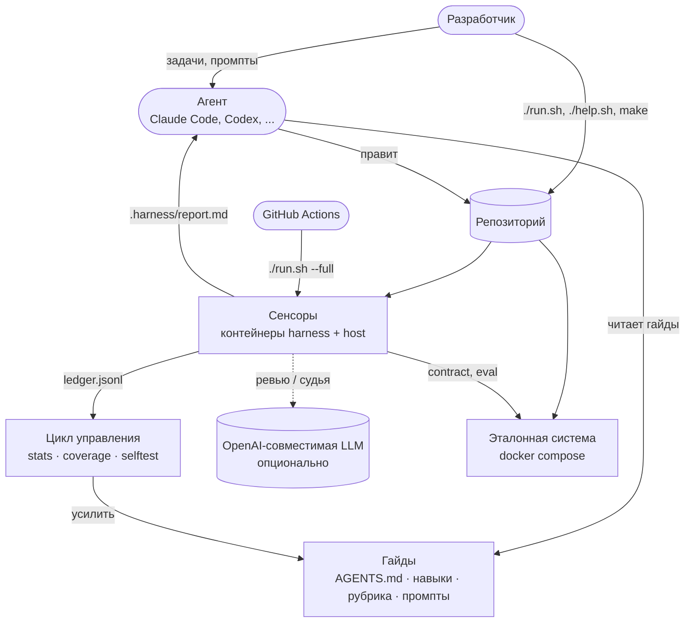
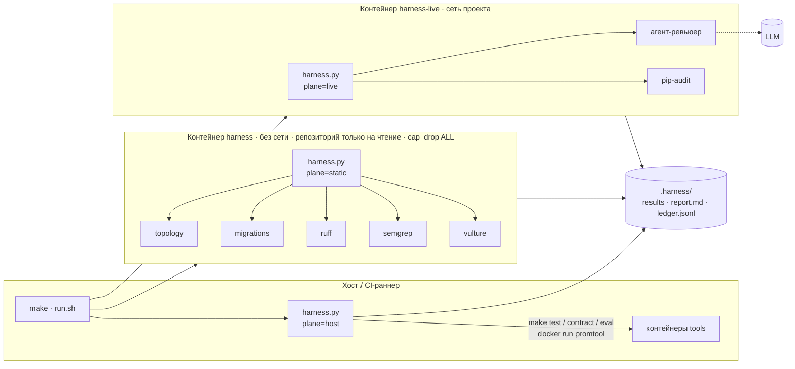
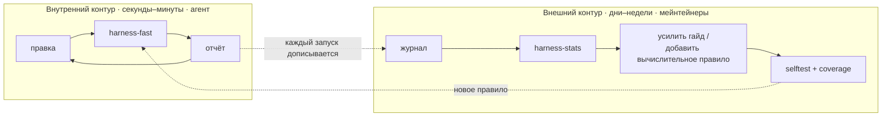
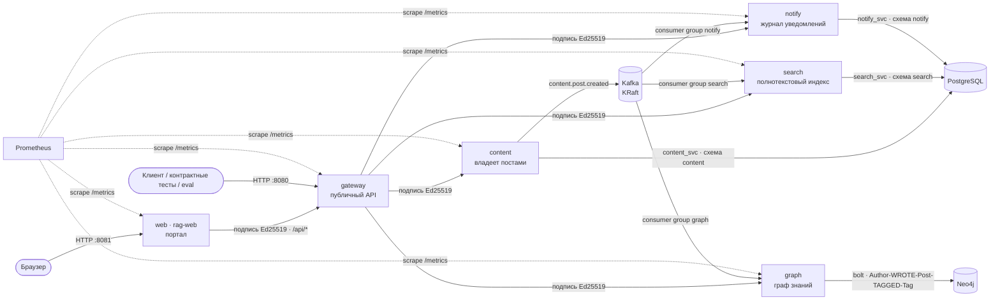
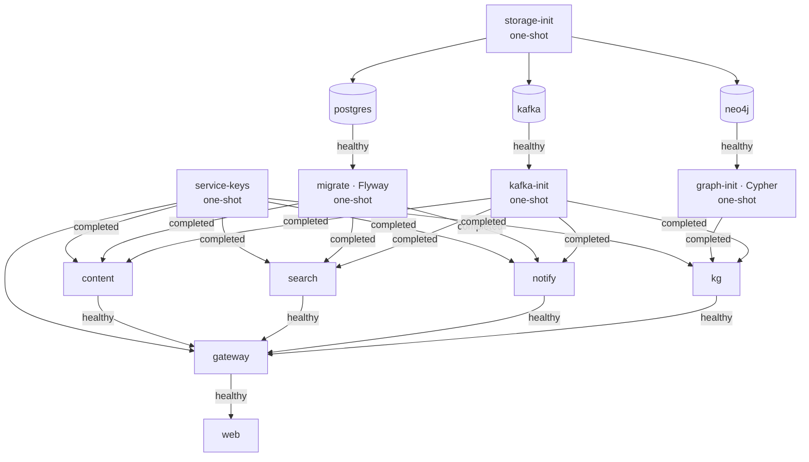

# 4. Реализованная архитектура

air-harness состоит из двух половин в одном репозитории:

1. **Harness** — гайды и сенсоры, которые регулируют агента.
2. **Эталонная система** — приложение, которое регулирует harness (gateway, content, search, notify поверх PostgreSQL, graph поверх Neo4j
   и Kafka). Она нужна, чтобы у каждого сенсора был реальный код для наблюдения; в вашем проекте её заменяют
   ваши сервисы.

## 4.1 Системный контекст

## 4.2 Архитектура harness

### Плоскости — где запускается сенсор

- **static** — герметичная и быстрая: нет сети, репозиторий смонтирован только на чтение, нет Linux-capabilities,
  корневая ФС только на чтение. Код агента не может «позвонить домой»; сенсоры наблюдают и никогда не правят.
- **live** — тот же образ в сети проекта: доступ к LLM и запущенному стенду.
- **host** — машина разработчика или CI-раннер через `make` и `docker compose` (контрактные тесты, eval,
  promtool).

Все три плоскости пишут в один каталог; раннер объединяет последний результат каждого сенсора стадии в один
отчёт.

### Стадии — когда запускается сенсор (качество — как можно левее)

| Стадия | Триггер | Сенсоры |
|---|---|---|
| pre-commit | каждое изменение (цикл агента, git-хук, Stop-хук) | topology, migrations, ruff, semgrep-local · review-agent (рекомендательный) |
| integration | перед «готово», стенд поднят | unit, contract |
| pipeline | CI на каждый PR / push | статические сенсоры + unit, contract, eval, prom-rules |
| continuous | ночью | dead-code, deps-audit (рекомендательные) |

### Манифест — это архитектура harness

`harness.yaml` объявляет 12 гайдов и 11 сенсоров. У каждого сенсора есть `kind`, `category`, `plane`, `stages`,
`blocking`, `run`, `pairs_with` (гайды, которые учат его правилу), `fix_hint` и опционально `selftest`
(фикстуры + команда). Раннер, матрица покрытия, отчёт и статистика управления выводятся из него.

### Контуры обратной связи

## 4.3 Архитектура эталонной системы

### Контейнеры и граф вызовов

| Сервис | Ответственность | Доступ | Данные | Доверяет |
|---|---|---|---|---|
| web | портал rag-web: отдаёт браузерный клиент (анализ, поиск, обозреватель графа, публикация) и проксирует его вызовы `/api/*` в gateway | хост `:8081` | — | (публичный) |
| gateway | публичный HTTP API; валидирует и проксирует; данных не хранит | хост `:8080` | — | (публичный) |
| content | создаёт, читает и перечисляет посты (с тегами); публикует `content.post.created` | внутренний `:8000` | `content.posts` (роль `content_svc`) | gateway |
| search | индексирует события; полнотекстовый поиск с фильтрами по автору и тегу | внутренний `:8000` | `search.documents` (роль `search_svc`) | gateway |
| notify | записывает одно уведомление на каждый новый пост (замена e-mail); выдаёт их список | внутренний `:8000` | `notify.outbox` (роль `notify_svc`) | gateway |
| graph | граф знаний авторов, постов и тегов; связанные посты, окрестность тега, посты тега, обзор | внутренний `:8000` | Neo4j (`Author`, `Post`, `Tag`; схема в `db/graph`) | gateway |

### Сквозные решения

| Аспект | Решение | Чем обеспечено |
|---|---|---|
| Идентичность сервиса | один ключ Ed25519 на сервис, генерирует one-shot `service-keys`; каждый сервис монтирует только свой закрытый ключ, а каждый вызываемый — публичные ключи | topology T2, T10 |
| Авторизация | вызываемый принимает только вызывающих из своего `TRUSTED_CALLERS`; без подписи → 401, недоверенный → 403 | topology T1, semgrep `unsigned-service-call`, contract `test_service_auth`, рубрика R1 |
| Владение данными | у каждого сервиса своя роль и схема; никаких чтений чужих схем | migrations M4, рубрика R4 |
| Изменения схемы | только Flyway, история только дописывается; у сервисов нет DDL | migrations M1–M5, semgrep `ddl-outside-migrations` |
| События | топики создаёт `kafka-init`, автосоздание выключено; идемпотентный консьюмер, коммит после записи | topology T5, semgrep `kafka-consumer-auto-commit`, рубрика R8 |
| Конфигурация | `${NAME:-default}` в compose + `.env.example` | topology T3, T8, рубрика R5 |
| Хранение данных | в `DATA_DIR`, никогда в репозитории | topology T9 |
| Наблюдаемость | JSON-логи с request id; `http_requests_total`, `http_request_duration_seconds`; алерты на сервис | topology T7, prom-rules |
| Цепочка поставки | закреплённые теги образов и версии пакетов | topology T6, deps-audit |
| Поведение | контрактные тесты — это спецификация | contract, рубрика R2 |

### Развёртывание и порядок старта (docker compose)

Опциональные профили: `observability` (Prometheus), `local-llm` (Ollama), `tools` (контейнеры contract, unit,
eval). One-shot-сервисы завершаются с кодом 0, а зависимые ждут `service_completed_successfully`.

### Безопасность контейнеров

Сервисы приложения работают под uid 10001 с `read_only: true`, `tmpfs: /tmp`, `cap_drop: [ALL]` и
`no-new-privileges`; порт публикует только gateway. Контейнеры сенсоров дополнительно работают под uid
вызвавшего пользователя, чтобы отчёты принадлежали разработчику.

Далее: [Компоненты](05-components.md)
