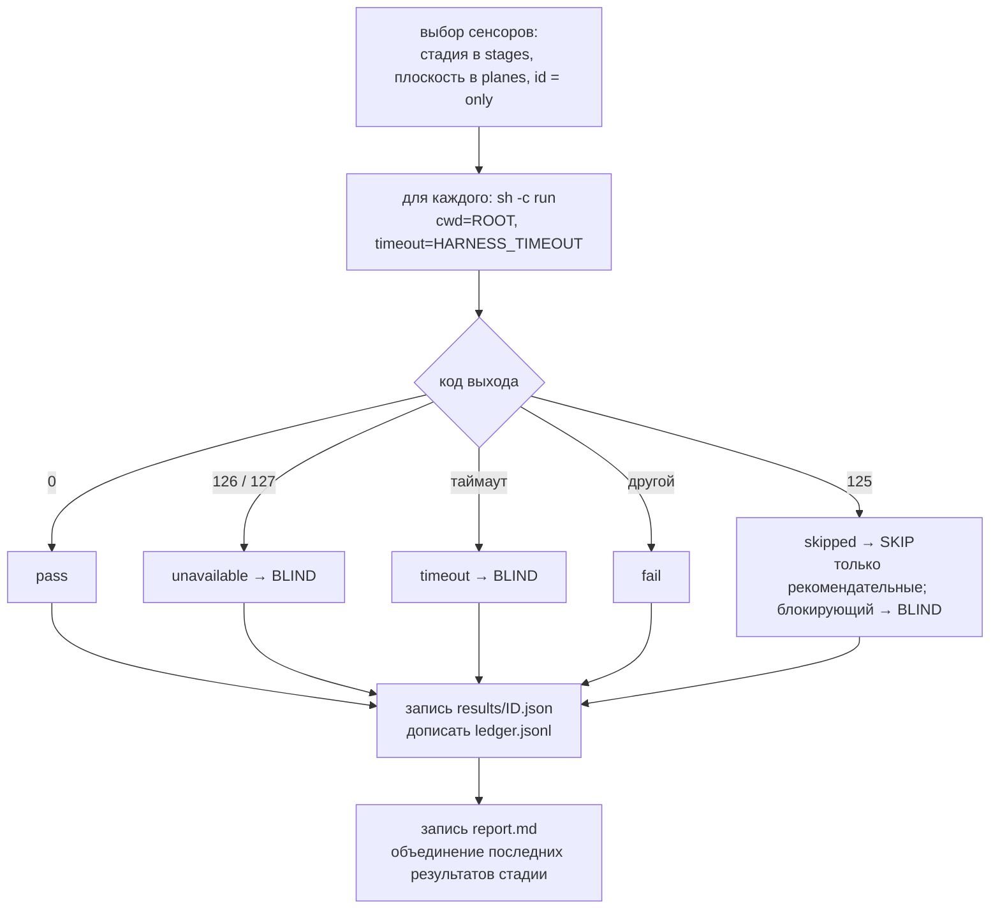
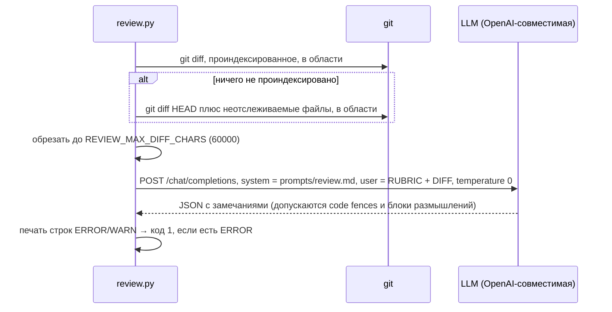
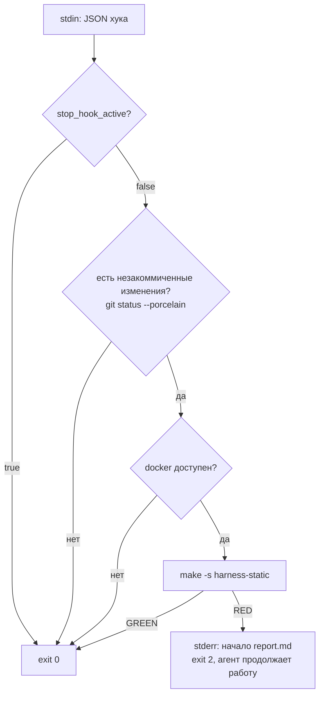
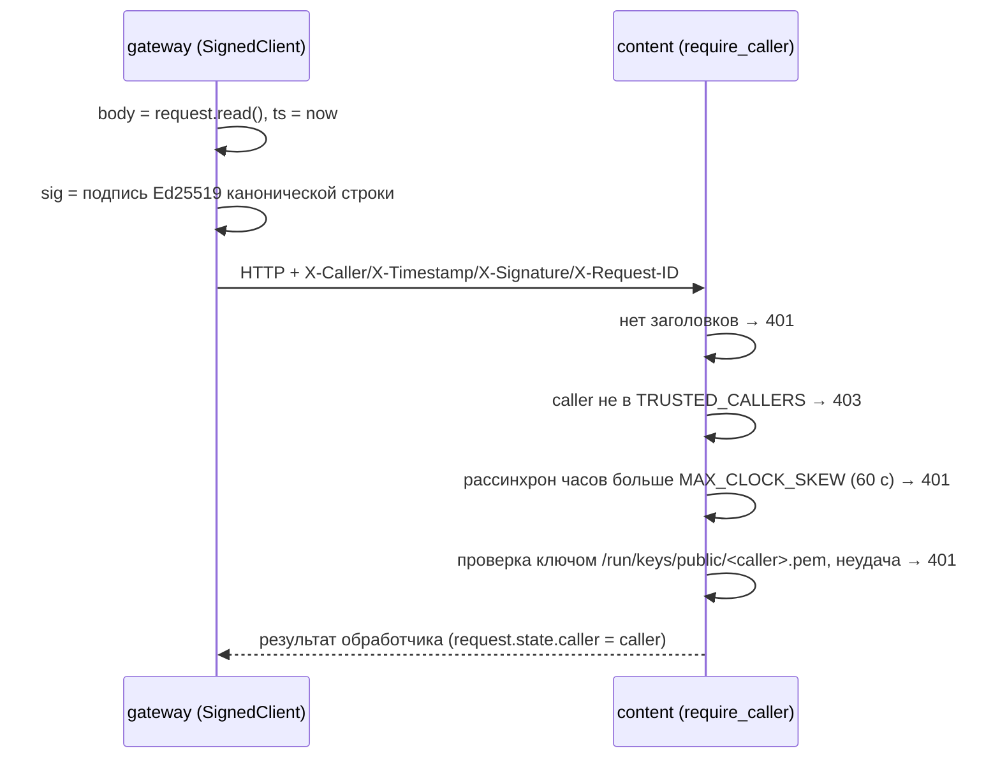
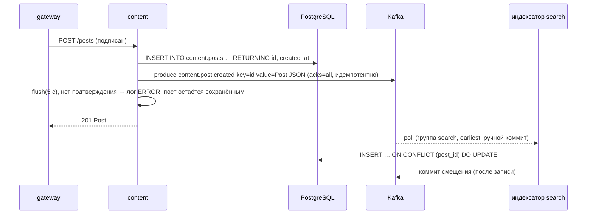
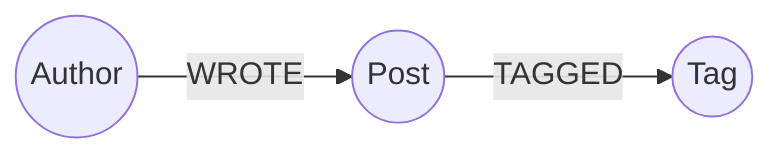
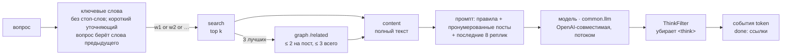
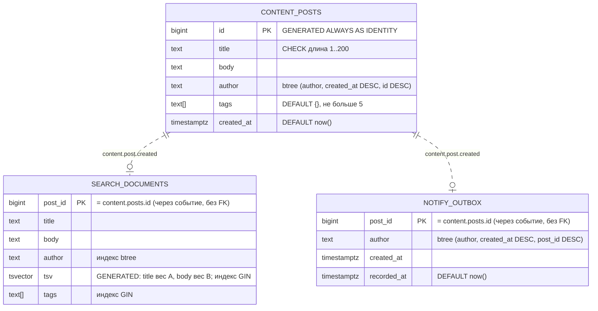
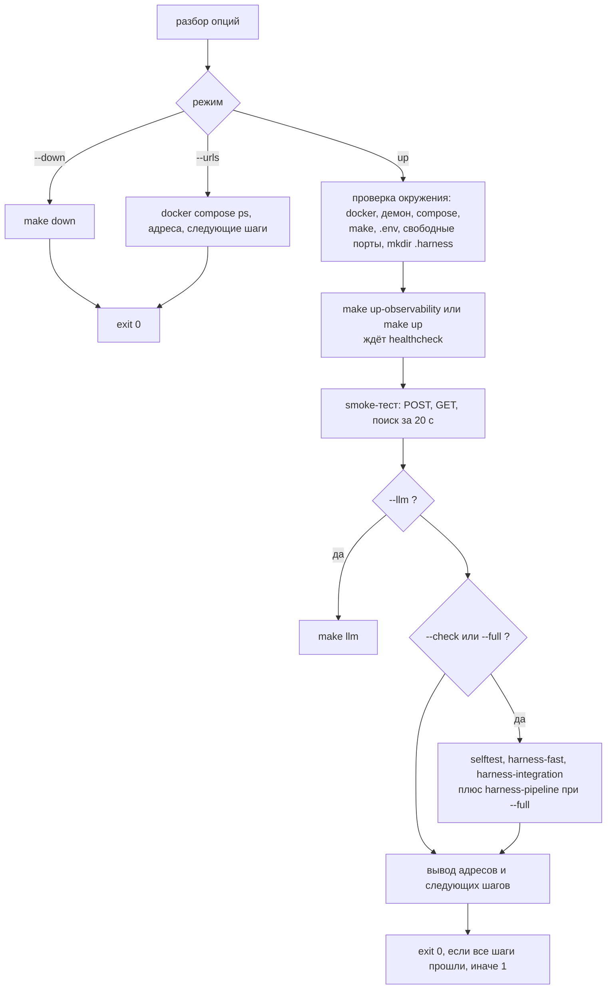

# 6. Низкоуровневый дизайн (LLD)

## 6.1 Раннер (`harness/harness.py`)

Один файл: стандартная библиотека + PyYAML. Один и тот же скрипт работает в контейнерах сенсоров и на хосте.

### Конфигурация (переменные окружения)

| Переменная | По умолчанию | Значение |
|---|---|---|
| `HARNESS_ROOT` | `.` | корень репозитория (`/work` в контейнерах) |
| `HARNESS_OUT` | `$HARNESS_ROOT/.harness` | каталог вывода (`/out` в контейнерах) |
| `HARNESS_MANIFEST` | `harness.yaml` | путь к манифесту относительно корня |
| `HARNESS_PLANE` | `all` | `--plane` по умолчанию (контейнеры задают `static` / `live`) |
| `HARNESS_TIMEOUT` | `900` (300 в compose) | секунд на команду сенсора |
| `HARNESS_TAIL_LINES` | `60` | сколько строк вывода сенсора сохраняется в результате |

### Команды и коды выхода

| Команда | Что делает | Коды выхода |
|---|---|---|
| `run --stage S [--plane P] [--only ID]` | запускает выбранные сенсоры, пишет результаты, журнал, отчёт | 0 зелёный · 1 блокирующий сенсор упал **или слеп** · 2 неизвестный id в `--only` · 3 сенсор из `--only` принадлежит другой плоскости |
| `selftest [--plane P] [--only ID]` | прогоняет `selftest.run` каждого сенсора на каждой фикстуре; только сенсоры своей плоскости (`HARNESS_PLANE`), для остальных печатает, где они проверяются | 0 все срабатывают / молчат · 1 какой-то сенсор слеп или шумит |
| `coverage` | матрица гайды × сенсоры, проверки согласованности | 0 согласовано · 1 есть проблемы |
| `stats [--min-runs N] [--window W]` | таблица управления по журналу и последним вердиктам selftest (`N` 20, `W` 10) | 0 |
| `list` | одна строка на сенсор | 0 |

### Выполнение сенсора



Сенсор — **любая команда**. Контракт: код 0 = пройдено; 125 = намеренно не настроен здесь (например, нет LLM) — раннер
сообщает SKIP, что никогда не роняет стадию, но только для рекомендательных сенсоров (блокирующий сенсор с кодом 125
считается BLIND); 126/127 = не может запуститься (BLIND, а не ошибка кода); любой другой = провал. Замечания печатаются по одному на строку, начиная с `ERROR` или `WARN`,
далее идут строки `what:` / `fix:` с отступом. Строки `WARN` (и две следующие строки с отступом) у *прошедшего*
сенсора всё равно попадают в отчёт.

### Файл результата — `.harness/results/<id>.json`

```json
{"id": "topology", "status": "fail", "rc": 1, "seconds": 0.11, "rev": "cdbf004",
 "stage": "pre-commit", "plane": "static", "kind": "computational", "category": "architecture",
 "blocking": true, "ts": 1790966386,
 "output": "<последние HARNESS_TAIL_LINES строк>", "warnings": ["WARN T6 ...\n      what: ...\n      fix: ..."]}
```

`status` ∈ `pass | fail | unavailable | timeout | skipped`. **Журнал** (`.harness/ledger.jsonl`) дописывает ту же запись
без `output` и `warnings`, по одной строке на запуск.

### Отчёт — `.harness/report.md`

Строится из последнего результата каждого сенсора, объявленного для стадии (поэтому контейнеры static и live,
запускаемые раздельно, дают один отчёт):

1. Заголовок: стадия, текущая ревизия, вердикт — **RED**, если какой-либо блокирующий сенсор упал или слеп,
   иначе **GREEN**.
2. *Blocking failures* — для каждого сенсора: вид, категория, `fix_hint` (*How to fix*), пути связанных гайдов,
   команда *Re-run only this* (`make harness-one s=<id>` для контейнерных плоскостей, команда
   `python3 harness/harness.py …` для плоскости host), хвост вывода.
3. *Advisory findings* — то же для неблокирующих провалов.
4. *Blind sensors* — статус и первые 300 символов вывода.
5. *Skipped (not configured)* — последняя строка вывода сенсора, где сказано, как его включить.
6. *Warnings* — блоки WARN прошедших сенсоров.
7. *Not run in this stage yet* — объявленные сенсоры без результата (например, другая плоскость).
8. *Passed*.

Результат, чей `rev` отличается от текущей ревизии, помечается **stale** (устаревший).

### Selftest

Для каждого сенсора с блоком `selftest` каждая запись из `selftest.fixtures` (файлы или каталоги, у которых
ожидание лежит в файле `.expect`) прогоняется через `selftest.run` с подстановкой `{fixture}`.

| Первая строка фикстуры | Успех, когда |
|---|---|
| `# expect: <текст>` | код выхода ∉ {0, 126, 127} **и** `<текст>` есть в выводе → `fires` |
| `# expect: clean` | код выхода 0 → `quiet` |
| без ожидания | код выхода ∉ {0, 126, 127} |

Иначе строка помечается `BLIND` / `NOISY`, и команда завершается с кодом 1. Фикстуры исключены из обычного
линтинга (`extend-exclude` в `pyproject.toml`).

### Проверки покрытия

Проблемы (код 1): `MISSING` — нет пути гайда или фикстур selftest · `BAD` — неизвестные вид/категория/стадия/
плоскость · `DANGLING` — `pairs_with` на несуществующий гайд · `DUP` — повтор id сенсора · `GAP` — категория без
сенсоров. Информация: `FF-ONLY` — гайд, который никто не проверяет · `FB-ONLY` — сенсор, которому не учит ни
один гайд · `RISK` — инференциальный и блокирующий · `UNPROVEN` — статический вычислительный сенсор без засеянных
дефектов.

### Stats — подсказки управления

По каждому сенсору: запуски, срабатывания (= провалы), доля, слепые запуски, среднее время, пропуски. Пропущенные
запуски считаются отдельно и не входят ни в одну долю (сенсор, который только пропускался, помечается *never ran*).
Порядок подсказок:
*слеп в > 20 % последних `--window` запусков (по умолчанию 10, пропуски учитываются)* → чинить окружение;
*доля > 30 %* → усилить связанный гайд; *ни разу не сработал за ≥ `--min-runs` запусков* → смотреть
`.harness/selftest.json` (его пишет каждый selftest): *proven* → код здесь чист, подумать о более поздней стадии;
*blind/noisy* → чинить сенсор; вердикта нет → запустить selftest.

## 6.2 Схема манифеста (`harness.yaml`)

```yaml
harness: 1
template: { name: py-services-pg-kafka, version: 0.5.1 }
categories: [maintainability, architecture, behaviour]
guides:
  - id: <уникальный>             # на него ссылается sensors.pairs_with
    path: <файл или каталог>     # должен существовать (coverage)
    kind: computational | inferential
    category: [<категория>, ...]
sensors:
  - id: <уникальный>
    kind: computational | inferential
    category: <категория>
    plane: static | live | host
    stages: [pre-commit | integration | pipeline | continuous, ...]
    blocking: true | false       # по умолчанию true
    run: <команда shell, cwd = корень репозитория>
    pairs_with: [<id гайда>, ...]
    fix_hint: <одна строка, показывается в отчёте>
    selftest:                    # опционально
      fixtures: <каталог>
      run: <команда с {fixture}>
```

## 6.3 Контейнеры сенсоров (`compose.harness.yml`, `harness.mk`)

Оба сервиса используют `image: ${HARNESS_IMAGE:-air-harness-runner:0.5.1}`, профиль `harness`,
`user: ${HARNESS_UID}:${HARNESS_GID}` (make подставляет вызвавшего пользователя), `read_only: true`,
`tmpfs: /tmp`, `cap_drop: [ALL]`, `no-new-privileges`, репозиторий в `/work:ro` и `./.harness` в `/out`.

| Сервис | Сеть | Дополнительное окружение |
|---|---|---|
| `harness` | `network_mode: none` | `HARNESS_PLANE=static`, `MIGRATIONS_BASE` |
| `harness-live` | сеть проекта + `host.docker.internal` | `HARNESS_PLANE=live`, `LLM_*`, `REVIEW_MODEL`, `REVIEW_DIFF_BASE`; `/tmp` смонтирован с `exec` (pip-audit создаёт там временный venv) |

У каждой контейнерной цели есть order-only-зависимость `| $(OUT_DIR)`, которая создаёт `.harness/` от имени
вызвавшего пользователя *до того*, как docker создал бы источник bind-монтирования от root. `harness-one`
запускает сенсор в `harness`; при коде 3 (другая плоскость) повторяет запуск в `harness-live`.

## 6.4 Сенсор топологии (`topology_check.py`)

Вход: compose-файл (`--strict` делает предупреждения провалом; используется в selftest). YAML разбирается через
`SafeLoader` (слияния `<<` раскрыты, `depends_on` — итоговый), а сырой текст сканируется на переменные
(комментарии удалены). Пути для T7/T8 берутся из самого compose-файла: `x-harness: {alerts, env_example}`.
Сервисы в dev-профиле (`TOPOLOGY_DEV_PROFILES`, по умолчанию `admin,local-llm,e2e,tools`) — это инструменты, и
правила T1, T4–T7, T9, T10 их пропускают.

| Правило | Уровень | Проверка |
|---|---|---|
| T1 caller-trusted | ERROR | для каждого `http(s)://<svc>:<port>` в env сервиса (с подставленными умолчаниями): если у `<svc>` есть `TRUSTED_CALLERS`, вызывающий должен быть в нём |
| T2 key-provisioned | ERROR / WARN | подпути ключей из `service-keys` должны быть в списке entrypoint `service-keys` (после `/keys`); у каждого доверенного вызывающего должен быть ключ; вызывающий монтирует свой ключ; WARN, если сервис подписывается чужой идентичностью |
| T3 default-drift | ERROR / WARN | одна переменная — одно значение по умолчанию; WARN при смешении `:-` и `-` |
| T4 migrate-first | ERROR | сервис с `DB_DSN` зависит от `migrate` |
| T5 topics-first | WARN | сервис с `KAFKA_BOOTSTRAP` зависит от `kafka-init` |
| T6 pinned-images | WARN | нет образов без тега / с `:latest`; помечает замороженные реестры (`bitnamilegacy/`) |
| T7 alerts-present | ERROR | у каждого долгоживущего (задан `restart`), собираемого сервиса без профиля есть `job="<name>"` в файле алертов |
| T8 env-documented | ERROR | каждая `${VAR}`, которую читает compose, есть строкой `VAR=` в примере env |
| T9 data-outside-repo | ERROR | нет bind-монтирования из репозитория (`./…`) с правом записи |
| T10 callee-verifies | ERROR | сервис с `TRUSTED_CALLERS` монтирует подпуть `public` тома `service-keys`; без него он не может проверить ни одну подпись и отвечает 401 на каждый вызов (проверяется, если есть `service-keys`) |

Формат вывода: `SEV  RULE  место` / `what:` / `fix:`; последняя строка — `topology: N services, E errors, W warnings`.

## 6.5 Сенсор миграций (`migrations_check.py`)

| Правило | Уровень | Проверка |
|---|---|---|
| M1 naming | ERROR | имя файла соответствует `^(V<n>|R)__<snake_case>.sql$` (файлы с точкой в начале игнорируются) |
| M2 unique-version | ERROR | каждая `V<n>` встречается один раз |
| M3 append-only | ERROR | `git diff --name-status $MIGRATIONS_BASE -- <dir>` не показывает `M`/`D` для `V`-файла (база по умолчанию `HEAD`; в CI — `origin/main`; вне git пропускается) |
| M4 granted | ERROR | у каждой `CREATE TABLE x` есть `GRANT … ON x TO …` в том же файле (комментарии удаляются; списки таблиц в grant разбираются по запятым) |
| M5 no-gaps | WARN | версии 1…max идут без пропусков |

## 6.6 Сенсор ревью (`review.py`)



Область: `services libs db contract docker-compose.yml infra`. Если задан `REVIEW_DIFF_BASE` → `git diff <base>`.
Пустой `LLM_BASE_URL` (по умолчанию: ревью включается явно) → код 125 (SKIP, с подсказкой, как включить).
Настроенный, но недоступный эндпоинт или ответ без JSON-объекта → код 127 (BLIND). `LLM_NO_THINK=true` отправляет
`chat_template_kwargs.enable_thinking=false` (серверы без поддержки игнорируют). Схема замечания:
`{severity: ERROR|WARN, rule, file, line, what, fix}`.

## 6.7 Stop-хук (`harness/hooks/agent-stop.sh`)



## 6.8 Подписанные межсервисные вызовы (`libs/common/common/service_auth.py`)

**Ключи.** `service-keys` запускает `python -m common.keygen /keys gateway content search notify graph web chat` от root: для каждого
сервиса `/keys/<name>/private.pem` (PKCS#8 Ed25519, права 0400, владелец uid 10001, каталог 0500) и
`/keys/public/<name>.pem` (0444). Идемпотентно: существующие ключи сохраняются. Каждый сервис монтирует
`subpath: <name>` в `/run/keys/self` и `subpath: public` в `/run/keys/public`, только на чтение.

**Каноническая строка и заголовки.**

```
canonical = METHOD + "\n" + PATH[?QUERY] + "\n" + UNIX_TIMESTAMP + "\n" + hex(SHA-256(body))
X-Caller:    <имя сервиса>
X-Timestamp: <секунды unix>
X-Signature: base64(Ed25519.sign(private_key, canonical))
X-Request-ID: <проброшенный request id>
```



Верификатор кэширует публичные ключи по вызывающему; `/healthz` и `/metrics` не защищены. Известное ограничение:
нет хранилища nonce, поэтому перехваченный запрос можно повторить в пределах окна рассинхрона (только внутри
сети).

## 6.9 Телеметрия (`libs/common/common/telemetry.py`)

`create_app(service, **fastapi_kwargs)`:

- JSON-строки логов в stdout: `ts, level, service, logger, msg, request_id[, exc]`; уровень из `LOG_LEVEL`;
  access-лог uvicorn отключён.
- Middleware: request id из `X-Request-ID` или новый UUID, возвращается в ответе; метрики по *шаблону маршрута*
  (`/api/posts/{post_id}`, несовпавшие → `unmatched`); `/metrics` и `/healthz` исключены.
- `http_requests_total{service,method,route,status}` (счётчик),
  `http_request_duration_seconds{service,method,route}` (гистограмма).
- `GET /healthz` → `{"status":"ok","service":…}`; `GET /metrics` → текстовый формат Prometheus.

### Консьюмер событий (`libs/common/common/events.py`)

`EventConsumer(topic, handler, bootstrap=…, group_id=…, name=…)` работает в одном фоновом потоке;
`confluent_kafka.Consumer` создаётся в `start()` с `enable.auto.commit=False`, `auto.offset.reset=earliest`.
Для каждого сообщения: ошибка брокера → лог (конец партиции игнорируется), ничего не обрабатывается и не
коммитится · JSON декодируется и передаётся в `handler(event)` · обработчик завершился → `commit(message,
asynchronous=False)` · не JSON или обработчик бросил `ValueError` / `KeyError` → лог как некорректное, коммит
(повтор не поможет) · любое другое исключение → лог, `seek` к тому же смещению, пауза `backoff` (2 с), повторная
доставка. Обработчики должны быть идемпотентными. Нужен extra `kafka` пакета `libs/common`.

## 6.10 Сервисы

### Публичный API (gateway)

| Метод | Путь | Параметры | Проксирует в | Ответы |
|---|---|---|---|---|
| GET | `/` | — | — | 307 → `/docs` |
| POST | `/api/posts` | JSON-тело (объект) | content `POST /posts` | 201 пост · 422 валидация · 502 недоступен upstream |
| GET | `/api/posts` | `author` (обязателен, `^[A-Za-z0-9._-]+$`), `limit` 1–50 (20) | content `GET /posts` | 200 `{author, posts[]}`, новые первыми · 422 · 502 |
| GET | `/api/posts/{post_id}` | `post_id: int` | content `GET /posts/{id}` | 200 · 404 · 422 · 502 |
| GET | `/api/search` | `q` 1–200 символов, `author?`, `tag?` (`^[a-z0-9-]{1,32}$`), `limit` 1–50 (10) | search `GET /search` | 200 `{query, hits[]}` · 422 · 502 |
| GET | `/api/notifications` | `author` (обязателен), `limit` 1–50 (20) | notify `GET /outbox` | 200 `{author, notifications[]}`, новые первыми · 422 · 502 |
| GET | `/api/posts/{post_id}/related` | `post_id: int`, `limit` 1–50 (10) | graph `GET /related/{id}` | 200 `{post_id, related[{id, title, author, score, shared_tags, same_author}]}` · 404 · 422 · 502 |
| GET | `/api/tags/{tag}` | `tag` `^[a-z0-9-]{1,32}$`, `limit` 1–50 (10) | graph `GET /tags/{tag}` | 200 `{tag, posts, related[{tag, together}]}` · 404 · 422 · 502 |
| GET | `/api/tags/{tag}/posts` | `tag` `^[a-z0-9-]{1,32}$`, `limit` 1–50 (20) | graph `GET /tags/{tag}/posts` | 200 `{tag, posts[{id, title, author}]}` (newest first) · 404 · 422 · 502 |
| GET | `/api/graph/overview` | `limit` 1–50 (10) | graph `GET /overview` | 200 `{posts, authors, tags, top_tags[{tag, posts}], top_authors[{author, posts}], tag_links[{source, target, together}]}` · 422 · 502 |
| POST | `/api/chat` | `{messages[{role, content}], k}` | chat `POST /chat` (поток через `common.relay`) | 200 `text/event-stream`: `sources`, `token`…, `done` · 422 · 502 |

### content

`PostIn`: `title` 1–200, `body` 1–20000, `author` 1–64 по шаблону `^[A-Za-z0-9._-]+$`, `tags` — 0–5 элементов
по шаблону `^[a-z0-9-]{1,32}$` (по умолчанию `[]`). `Post` = `PostIn` + `id: int`, `created_at: datetime`.
`GET /posts?author=&limit=` возвращает `{author, posts[]}` в порядке `created_at DESC, id DESC` по индексу
`posts_author_created_idx`.



Событие `content.post.created` (3 партиции): ключ = id поста, значение =
`{"id", "title", "body", "author", "tags", "created_at"}` (`tags` добавлено позже; консьюмеры считают
отсутствующее поле равным `[]`). Только добавляющие изменения; ломающее изменение требует нового топика.
Консьюмеры: `search`, `notify` и `graph`.

### search

- **Индексатор**: `EventConsumer` (группа `search`) с обработчиком `index_post` — upsert в `search.documents`,
  отсутствующие `tags` → `[]`. At-least-once + upsert = фактически ровно один раз.
- **Запрос:** `websearch_to_tsquery('english', q)` по `tsv`; ранг `ts_rank_cd`; сортировка `score DESC,
  post_id DESC`; опциональные фильтры `author =` и `tag = ANY (tags)`; `LIMIT` 1–50 (по умолчанию 10).
  Результаты: `{id, title, author, tags, score}`.

### notify

- **Консьюмер**: `EventConsumer` (группа `notify`) с обработчиком `record_notification` — одна строка
  `notify.outbox` на событие, `INSERT … ON CONFLICT (post_id) DO NOTHING`. Повторно доставленное событие не
  создаёт второго уведомления.
- **`GET /outbox?author=&limit=`** (1–50, по умолчанию 20) → `{author, notifications[{post_id, author,
  created_at}]}` в порядке `created_at DESC, post_id DESC`.

### graph

Neo4j (`bolt://neo4j:7687`, пользователь `neo4j`, пароль `GRAPH_DB_PASSWORD`); данные в `DATA_DIR/neo4j`.



- **Схема**: `db/graph/V1__constraints.cypher` — уникальные `Post.id`, `Author.name`, `Tag.name`; применяет
  одноразовый `graph-init` (`cypher-shell -f`, `IF NOT EXISTS`) до старта `graph`. Файлы только добавляются.
- **Запись**: `EventConsumer` (группа `graph`) с обработчиком `index_post` — один `MERGE` для автора, поста
  (`SET title, created_at`), `WROTE` и для каждого тега `MERGE (t:Tag)` + `TAGGED`. Идемпотентно: повторное событие
  ничего не меняет. Новая группа консьюмера начинает с самого раннего смещения, поэтому граф сам восстанавливается
  из топика.
- **`GET /related/{post_id}?limit=`** (1–50, по умолчанию 10): посты с общими тегами и посты того же автора;
  `score = |shared_tags| + (1, если тот же автор)`; порядок `score DESC, id DESC`; 404, если поста нет в графе.
- **`GET /tags/{tag}?limit=`**: `posts` — посты с этим тегом; `related` — теги, встречающиеся вместе с ним,
  `together` — число постов с обоими, порядок `together DESC, tag`; 404 для неизвестного тега.
- **`GET /tags/{tag}/posts?limit=`** (1–50, по умолчанию 20): самые новые посты с тегом, `{id, title, author}`;
  404 для неизвестного тега.
- **`GET /overview?limit=`** (1–50, по умолчанию 10): `posts`, `authors`, `tags` (число узлов); `top_tags` и
  `top_authors` по числу постов; `tag_links` — пары среди топ-тегов, `together` — число постов с обоими
  (`source < target`, порядок `together DESC`). Питает страницу «Анализ» и карту тем портала.

### chat

`services/chat/app.py` (эндпоинт, выборка, стриминг) и `rag.py` (чистые шаги конвейера). `POST /chat`
`{messages: [{role: user|assistant, content ≤ 4000}] (1–20, последнее — user), k: 1–10 (5)}` → `text/event-stream`.



| Событие | Данные |
|---|---|
| `sources` (первое, одно) | `[{id, title, author, tags, via: search\|graph, near?, snippet}]` — что получила модель |
| `token` | `{text}` — ответ по частям |
| `done` (последнее) | `{citations: [id, процитированные как [#id] и входящие в источники], model: имя\|null}` |
| `error` | `{detail}` — модель сломалась, уже начав отвечать |

Ошибки выборки — HTTP-ошибки до начала потока (502). Без модели (`CHAT_LLM_URL` пуст, недоступен или вернул ошибку)
ответ перечисляет найденные посты со ссылками, `model` = `null`; если подходящих постов нет — так и говорит. Клиент
модели (`libs/common/common/llm.py`) — единственное место вызова модели: правило semgrep `unsigned-service-call`
не пускает «сырой» HTTP в `services/`. Gateway и web передают поток через `common.relay` (части пересылаются по
мере прихода, таймаут чтения 180 с). Контракт: `contract/test_chat.py` выполняется и с моделью, и без неё.

### web (rag-web)

Портал: приложение FastAPI (`services/web/app.py`), которое отдаёт браузерный клиент без зависимостей
(`services/web/static/`: `index.html`, `app.js` — роутер и страницы, `graph.js` — силовая раскладка графа в SVG,
`style.css`, `sample-posts.json`) и проксирует `GET`/`POST /api/{path}` в gateway через `SignedClient`
(подпись `web`; API gateway публичный, списка доверенных у него нет). Страница и API на одном origin: CORS не нужен.
Лимит тела 64 КиБ (413), сегменты `..` отклоняются (404), другие методы — 405, gateway недоступен — 502; статус и
тело ответа gateway передаются без изменений. Порт на хосте `WEB_PORT` (8081).

| Страница | Маршрут | Вызовы |
|---|---|---|
| Анализ | `#/` | `/api/graph/overview` — счётчики, топ тегов и авторов, карта тем (граф совместных тегов), сильнейшие пары; на пустом графе загружает примеры постов |
| Поиск | `#/search?q=&tag=&author=` | `/api/search` — результаты с подсветкой, фасеты по тегам и авторам |
| Публикация | `#/write` | `POST /api/posts`, затем опрос search, `/related` и `/api/notifications`: видно, как догоняет каждый консьюмер |
| Пост | `#/post/{id}` | `/api/posts/{id}`, `/related` — текст, связанные посты с оценкой, граф окрестности |
| Тег | `#/tag/{tag}` | `/api/tags/{tag}`, `/api/tags/{tag}/posts` — совместные теги, новые посты, авторы |
| Автор | `#/author/{name}` | `/api/posts?author=`, `/api/notifications` — посты, темы, уведомления, карта автора |
| Обозреватель графа | `#/graph?tag=\|post=\|author=` | клик по узлу раскрывает соседей (тег → посты и теги, пост → автор, теги и связанные, автор → посты и теги) |
| Чат | `#/chat` | `POST /api/chat` (потоком) — диалог с ответом в реальном времени, ссылки `[#id]`, панель источников с их графом, «Стоп», «Новый чат»; диалог хранится на время сессии браузера |

## 6.11 База данных (`db/migrations`)

| Миграция | Содержимое |
|---|---|
| `V1__service_roles.sql` | роли `content_svc`, `search_svc` (`LOGIN`, пароль из плейсхолдеров Flyway `${content_db_password}`, `${search_db_password}`); `REVOKE CREATE ON SCHEMA public FROM PUBLIC` |
| `V2__content_posts.sql` | схема `content`; `content.posts` |
| `V3__search_documents.sql` | схема `search`; `search.documents` + индексы |
| `V4__content_posts_author_idx.sql` | индекс `(author, created_at DESC, id DESC)` для списка по автору |
| `V5__content_posts_tags.sql` | `content.posts.tags text[] NOT NULL DEFAULT '{}'`, не больше 5 |
| `V6__search_documents_tags.sql` | `search.documents.tags` + индекс GIN |
| `V7__notify_outbox.sql` | роль `notify_svc` (плейсхолдер `${notify_db_password}`); схема `notify`; `notify.outbox` + индекс |



Права: `content_svc` → `USAGE` на `content`, `SELECT, INSERT` на `content.posts`. `search_svc` → `USAGE` на
`search`, `SELECT, INSERT, UPDATE` на `search.documents`. `notify_svc` → `USAGE` на `notify`, `SELECT, INSERT`
на `notify.outbox`. Владелец объектов — пользователь миграций (`postgres`).
One-shot `migrate` запускает Flyway с `FLYWAY_CONNECT_RETRIES=30`; плейсхолдеры берутся из
`CONTENT_DB_PASSWORD` / `SEARCH_DB_PASSWORD` / `NOTIFY_DB_PASSWORD` — тех же переменных, что и в `DB_DSN` каждого сервиса.

## 6.12 Eval (`eval/run_eval.py`)

1. Загрузить `corpus.yaml` (`version`, `docs[key,title,body]`, `queries[q, relevant[]]`).
2. Автор `eval-<version>`; если корпус ещё не проиндексирован — создать каждый документ через `POST /api/posts`;
   ждать до 60 с, пока не найдутся все заголовки (индексация асинхронная).
3. Для каждого запроса: `GET /api/search?q=…&author=…&limit=10`; сопоставить id результатов с ключами документов.
   - recall@5 = |релевантные ∩ топ-5| / |релевантные|
   - RR = 1 / позиция первого релевантного (0, если нет); MRR@10 = среднее RR
   - судья (опционально, `JUDGE_BASE_URL`): первый результат оценивается 0–3 по `harness/prompts/judge.md`;
     judge@1 = Σ оценок / (3 · число оценённых)
4. Регрессия = recall@5 или MRR@10 < baseline − `EVAL_TOLERANCE` (0.05) → код 1 (сенсор блокирующий).
   Падение judge@1 печатается и помечается `drop (advisory)`; запуск оно не роняет.
5. `EVAL_BASELINE` (по умолчанию `eval/baseline.json`) позволяет selftest harness сравнить поиск с засеянными
   baseline из `harness/sensors/fixtures/eval/`.
6. Пишет `$EVAL_OUT/eval-results.json` (осознанно переносится в `eval/baseline.json`) и `eval-report.md`.

## 6.13 `run.sh`



Значения адресов берутся из окружения, затем из `.env`, затем по умолчанию (`PUBLIC_HOST`, `GATEWAY_PORT`,
`PROMETHEUS_PORT`, `OLLAMA_PORT`). Доступными показываются только запущенные сервисы.

## 6.14 CI (`.github/workflows/harness.yml`)

Триггеры: pull request, push в `main`, ночью (03:17 UTC), вручную. Один джоб на `ubuntu-latest`:
checkout (полная история) → setup-python 3.12 + PyYAML, `DATA_DIR=$RUNNER_TEMP/air-harness-data` →
`make harness-build` → `make harness-test`, `harness-coverage`, `harness-selftest` → `make harness-static` →
ночью: `make harness-selftest-live`, `make harness-continuous`; иначе `./run.sh --full` → отчёт и отчёт eval в сводку джоба → логи сервисов
при провале → `.harness/` как артефакт → `make clean`. `MIGRATIONS_BASE` — `origin/<базовая ветка>` для
pull request и `HEAD~1` для push.

## 6.15 Справочник конфигурации

У всех переменных есть умолчания в `docker-compose.yml` / `compose.harness.yml`, и все они перечислены в
`.env.example` (это обеспечивает topology T8). Основные:

| Переменная | По умолчанию | Назначение |
|---|---|---|
| `DATA_DIR` | `/var/tmp/air-harness` | постоянные данные (postgres, kafka, ollama) |
| `GATEWAY_PORT` / `WEB_PORT` / `PROMETHEUS_PORT` / `OLLAMA_PORT` | 8080 / 8081 / 9090 / 11434 | порты на хосте |
| `POSTGRES_DB`, `POSTGRES_PASSWORD` | `air_harness`, `postgres-dev` | база данных |
| `CONTENT_DB_PASSWORD`, `SEARCH_DB_PASSWORD`, `NOTIFY_DB_PASSWORD` | `content-dev`, `search-dev`, `notify-dev` | роли сервисов |
| `GRAPH_DB_PASSWORD`, `NEO4J_HEAP` | `graph-dev`, `512m` | хранилище графа Neo4j |
| `CHAT_LLM_URL`, `CHAT_MODEL`, `CHAT_LLM_API_KEY` | `http://ollama:11434/v1`, `qwen3:8b`, `not-needed` | модель чата (любой OpenAI-совместимый эндпоинт; пустой URL — ответы только списком источников) |
| `LOG_LEVEL` | `INFO` | сервисы |
| `KAFKA_HEAP_OPTS` | `-Xmx512m -Xms256m` | куча брокера |
| `*_TAG` | закреплены | версии образов |
| `LLM_BASE_URL`, `LLM_MODEL`, `LLM_API_KEY`, `REVIEW_MODEL`, `LLM_NO_THINK` | пусто (ревью пропускается), `qwen3:8b` | агент-ревьюер (включается явно) |
| `REVIEW_DIFF_BASE` | пусто | что именно ревьюит ревьюер |
| `EVAL_TOLERANCE`, `JUDGE_BASE_URL`, `JUDGE_MODEL`, `JUDGE_API_KEY` | 0.05, пусто | eval |
| `HARNESS_IMAGE`, `HARNESS_TIMEOUT`, `MIGRATIONS_BASE` | раннер 0.5.1, 300, `HEAD` | harness |
| `PUBLIC_HOST` | `localhost` | имя хоста в адресах, которые выводит `run.sh` |

Далее: [Демо](07-demo.md) · назад к [оглавлению документации](../README.md).
