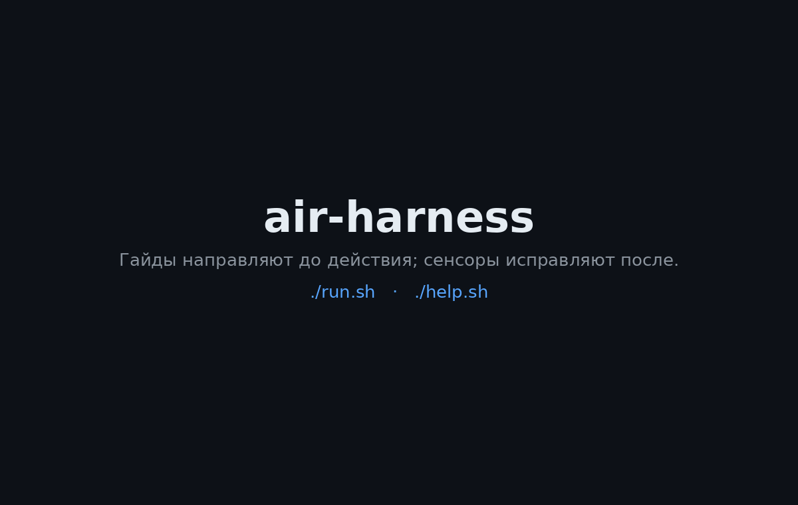
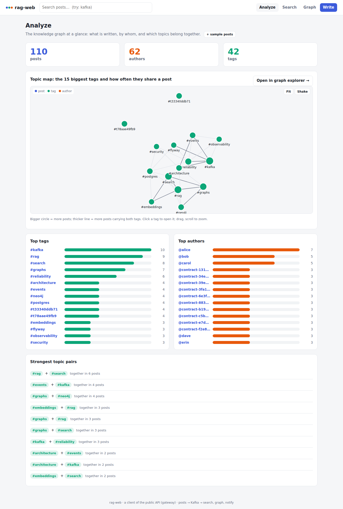
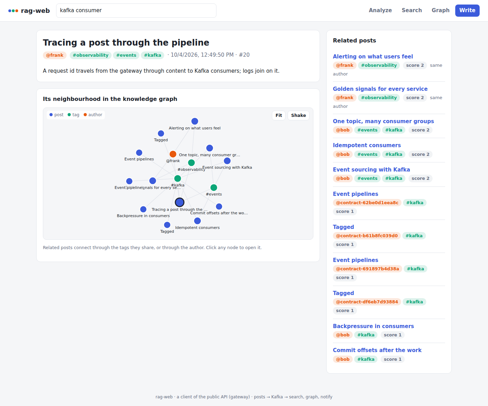
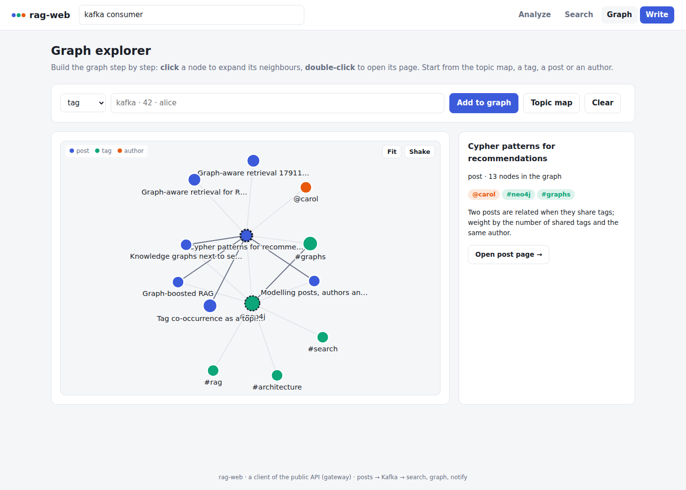
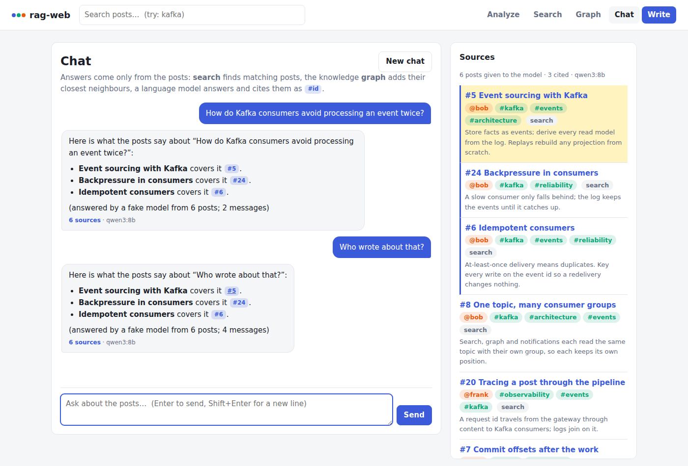
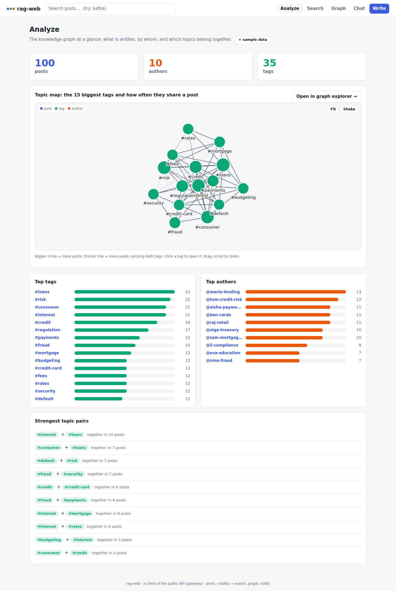
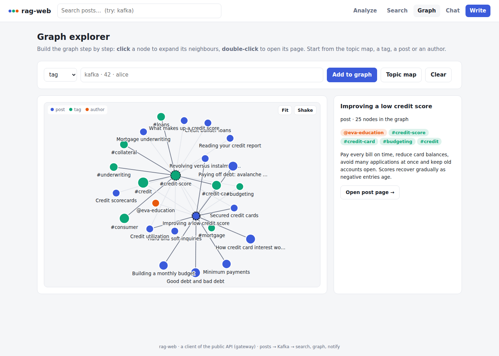
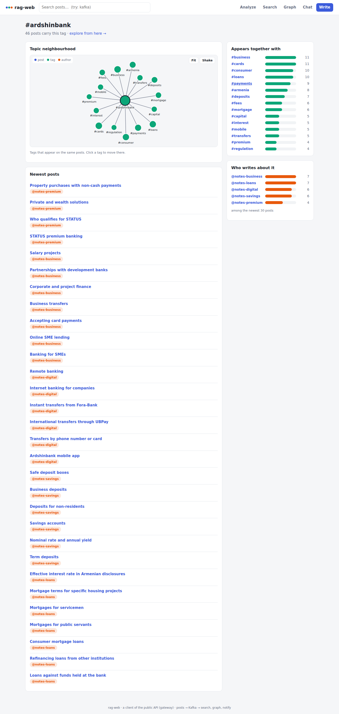
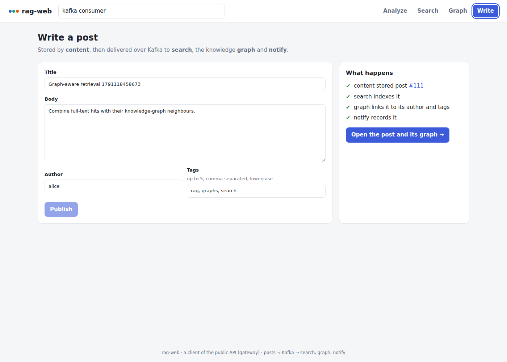
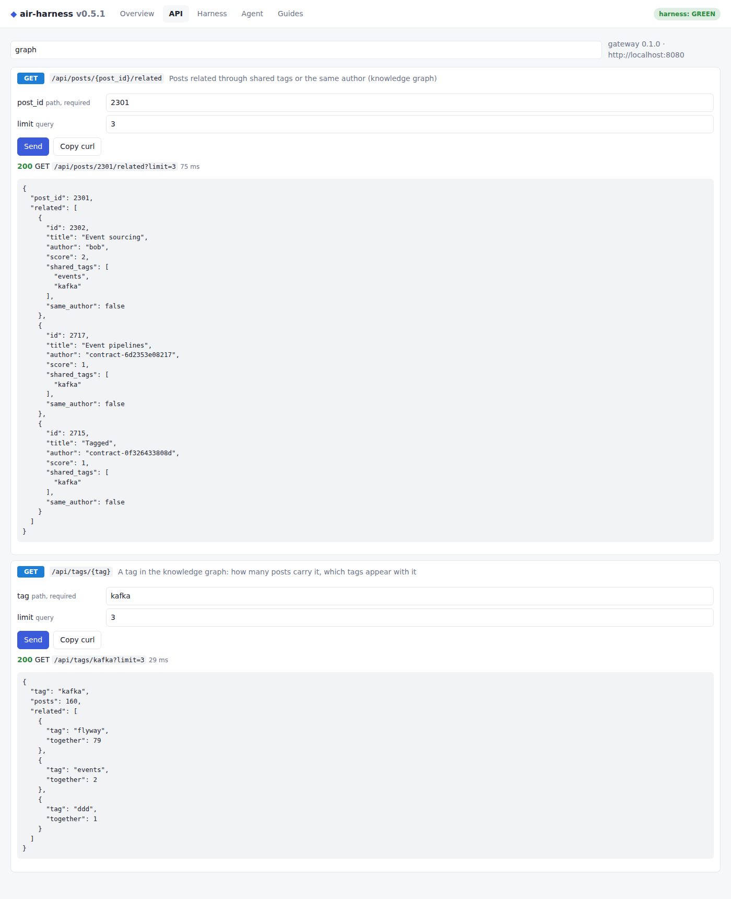

# 7. Демо — скриншоты и обзор

Всё на этой странице снято с реального запуска продукта: чистый `./run.sh --full` на Docker 29 / Compose v5,
настоящий API в браузере, настоящий Prometheus и намеренная ошибка, отданная harness. Ничего не подделано.

## Обзор (46 с)

1. `./run.sh` поднимает стенд и делает smoke-тест · 2. `--full` прогоняет все стадии harness · 3. выводит все
адреса · 4–6. публичный API в Swagger UI: создать пост, найти его поиском · 7–8. Prometheus опрашивает все
сервисы · 9–11. агент добавляет сервис и SQL-запрос через f-string → RED-отчёт → Stop-хук возвращает его к
работе · 12. после исправления быстрый цикл GREEN · 13. пошаговые промпты для следующего шага.

Подписи к скриншотам ниже — на русском; сами экраны (терминал, Swagger, Prometheus) — на английском, как и в
продукте.

## 1. Запуск — `./run.sh --full`

**Проверка окружения, сборка, старт, smoke-тест.** Все сервисы healthy, затем пост создаётся, читается и
находится поиском через Kafka.

**Harness доказывает себя, затем проверяет код.** Засеянные дефекты срабатывают, чистые фикстуры молчат, затем
идут стадии pre-commit, integration и pipeline. Агент-ревьюер здесь BLIND, потому что LLM не настроена — он
рекомендательный и никогда не блокирует.

**Где что находится.** Все доступные адреса, как попасть во внутренние сервисы, отчёты и следующие шаги.

## 2. Портал — http://localhost:8081

rag-web, собственный клиент приложения (сервис `web`), снято в Chromium после загрузки примеров постов.
**Анализ**: счётчики, карта тем (теги с общими постами), топ тегов и авторов, сильнейшие пары.

**Пост**: текст, связанные посты по общим тегам и автору, окрестность в графе.

**Обозреватель графа**: начат с `#neo4j`, затем раскрыт один пост: его автор, теги и связанные посты.

**Чат**: вопрос проходит через search, затем граф, затем content; ответ приходит потоком и ссылается на
использованные посты, которые перечислены в боковой панели (процитированные отмечены) вместе с графом их тегов.
Снято в песочнице сборки с подставной OpenAI-совместимой моделью, которая лишь перечисляет переданные ей посты; с
Ollama или внешней моделью ответ — связный текст, остальная страница та же.

**Банковский набор** (`./app.sh seed bank`): 100 постов от 10 авторов, 35 тегов. «Анализ» показывает крупные темы
— кредиты, риск, кредит, платежи, мошенничество — и их связи; обозреватель графа, начатый с `#credit-score` и с одним
раскрытым постом, связывает рейтинг с картами, кредитами, андеррайтингом ипотеки и бюджетом.

**Набор Ардшинбанка** (`./app.sh seed ardshinbank`): 46 постов по материалам публичного сайта реального банка,
у каждого поста — ссылка на источник. Страница тега `#ardshinbank` показывает, как связаны темы карт, кредитов,
депозитов, бизнес- и цифрового банкинга.

**Публикация**: опубликовать и увидеть, как каждый консьюмер `content.post.created` догоняет.

## 3. API — http://localhost:8080

Корень перенаправляет на Swagger UI. Gateway — единственный публичный сервис; все вызовы за ним подписаны.

| Создание поста (201) | Поиск находит его (индексация через Kafka) |
|---|---|
|  |  |

ReDoc по адресу `/redoc`:

## 4. Наблюдаемость — http://localhost:9090

| Все сервисы опрашиваются и UP | Правила алертов на сервис (их требует topology T7) |
|---|---|
|  |  |

Частота запросов по сервисам и статусам (`sum by (job, status) (rate(http_requests_total[1m]))`) — коды 422 —
это ошибки валидации, которые генератор трафика отправлял намеренно:

## 5. Harness ловит ошибку агента

Сценарий: агент добавляет сервис `notify`, который вызывает `content`, и собирает SQL-запрос через f-string. Он
забывает про `TRUSTED_CALLERS`, ключ сервиса, правила алертов и новую переменную в `.env.example`.

**Статические сенсоры становятся RED** за секунды, без сети:

**Отчёт точно говорит, что не так и как исправить** — каждое замечание называет ключ compose, гайд, который учит
правилу, и команду для перезапуска только этого сенсора:

**Агент не может объявить «готово».** Stop-хук Claude Code запускает статические сенсоры на незакоммиченных
изменениях и завершается с кодом 2 и отчётом — агент возвращается к работе:

**После исправления** быстрый цикл снова GREEN:

| `make harness-fast` | `.harness/report.md` |
|---|---|
|  |  |

## 6. Изучить и передать агенту — `./help.sh`

| `./help.sh` | `./help.sh prompts` |
|---|---|
|  |  |

`./help.sh prompt 02` выводит готовый к вставке промпт (`claude "$(./help.sh prompt 02)"`):

## 7. Веб-консоль

`./run.sh --console` → http://127.0.0.1:8090. Снято при работающем стеке в Chromium (Playwright).

**Overview** — здоровье стека, вердикт, цикл:

**API** — формы, построенные по OpenAPI gateway; здесь создаётся пост и находится через поиск:

Эндпоинты графа знаний (сервис `graph`, Neo4j) появляются в той же вкладке без изменений интерфейса — посты,
связанные общими тегами и авторами, и окрестность тега:

**Harness** — любая стадия в один клик; у каждого сенсора последний результат, вердикт selftest и история:

**Agent** — настоящий запуск: промпт уходит в `claude -p`, ответ приходит потоком, а лента показывает запуск
pre-commit, который выполнил его Stop-хук при завершении:

**Guides** — AGENTS.md, навыки, рубрика и промпты:

Назад к [оглавлению документации](../README.md) · предыдущая: [Низкоуровневый дизайн](06-low-level-design.md)
